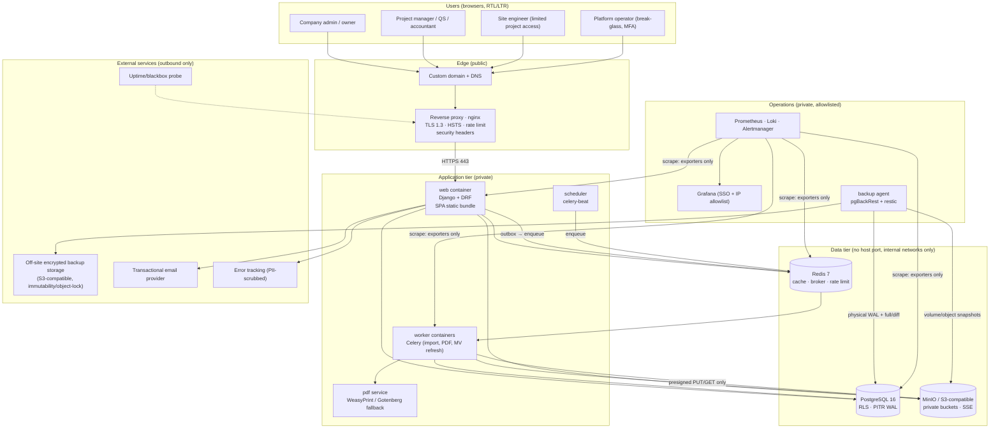

# B. High-Level Infrastructure Architecture

One production Linux VPS runs a small number of containers on isolated Docker networks. The shape is
deliberately boring: everything is a container, every stateful component is private, and every
external entry point is the proxy.

---

## 1. Context diagram



**Reading of the diagram:** the only container with a public listener is the reverse proxy. The
proxy is the only container on both the edge network and the application network. PostgreSQL,
Redis and MinIO are on an internal-only Docker network with `internal: true`, so no host port and no
outbound route; the host firewall is a second layer, not the primary control
(see [P §5](P-deployment-vps-docker.md) — Docker's iptables rules can bypass UFW, so "never publish
the port" is the real control).

---

## 2. Component responsibilities

| Component | Responsibility | Explicitly NOT responsible for |
|---|---|---|
| **Reverse proxy (nginx)** | TLS termination, HTTP→HTTPS redirect, HSTS/security headers, request size limits, per-IP rate limits, static SPA bundle, `X-Forwarded-*` normalisation, access logs, optional client-cert/IP allowlist for Grafana | Any authorization decision. The proxy is not an authz layer; it may only *reduce* exposure. |
| **web (Django/DRF)** | Authentication, session validation, tenant resolution, authorization, business rules, all reads/writes, PDF/queue dispatch | Long CPU work in the request cycle; direct public DB exposure; serving tenant files from disk |
| **worker (Celery)** | Excel parsing/validation for BOQ import, PDF rendering, bulk exports, MV refresh, notification sending, outbox consumption, backup verification jobs, approval SLA escalation | Any operation bypassing the tenant-context contract ([F §7](F-tenant-isolation.md)) |
| **scheduler (beat)** | Cron-like schedules: nightly MV refresh, outbox sweeper, backup verification, retention/pruning, audit checkpoint export, session GC | Business authorization |
| **PostgreSQL** | System of record; enforces tenant isolation (RLS), financial constraints (generated amounts, CHECKs, composite FKs), immutability triggers, hash-chained audit | Being reachable from the internet or from a developer's laptop against production |
| **Redis** | Session/cache store, rate-limit counters, Celery broker/result backend | Durable system of record for anything financially meaningful |
| **MinIO / object storage** | Private tenant file storage, server-side encryption, versioning | Public read access; authorizing downloads (the app authorizes, then issues a short-lived presigned URL) |
| **backup agent** | pgBackRest physical backups + continuous WAL archiving; restic encrypted volume/object backups; upload to off-site immutable bucket; restore verification | Holding the only copy of anything, or storing its own encryption keys alongside the data |

---

## 3. Environment topology

| Env | Purpose | Data | Notes |
|---|---|---|---|
| **local** | Developer machines | Synthetic only | Docker Compose with the same PG major version; backend role set identical to prod so RLS behaves the same |
| **ci** | Automated tests | Ephemeral containers | Real PG instances via testcontainers; tests connect as the *non-owner* app role |
| **staging** | Pre-production verification, migrations rehearsal, demo | **Synthetic or anonymised only** — never a production clone with unmasked PII/money | Same image digests as production, different secrets, `noindex`, IP allowlist or Basic Auth |
| **production** | Customer tenants | Real | Single VPS now; scale path in [P §9](P-deployment-vps-docker.md) |

Environments never share credentials, buckets, database clusters, or backup repositories. Staging
cannot decrypt production backups (separate key material).

---

## 4. Data flow: request lifecycle (the security spine)

```mermaid
sequenceDiagram
    autonumber
    participant B as Browser (React SPA)
    participant N as nginx
    participant M as Middleware chain
    participant A as Authorization choke point
    participant S as Domain service
    participant P as PostgreSQL (RLS + app_rw)

    B->>N: HTTPS request (__Host-session cookie, CSRF header)
    N->>M: proxy_pass (X-Forwarded-For/Proto, size & rate limits applied)
    M->>M: TLS/scheme + host validation, security headers
    M->>M: Session lookup (opaque id → hashed lookup) → user, active_company (server-validated)
    M->>M: Tenant transaction opens + SET LOCAL app.current_company_id
    M->>A: PrincipalContext built (membership, roles, permissions, project scopes)
    A->>A: require(permission) + project scope resolution (404 if out of scope)
    A->>S: authorized command with validated, typed payload
    S->>P: SELECT/INSERT inside tenant-scoped transaction (RLS applies)
    P-->>S: rows (0 rows if context mismatched — fail closed)
    S->>P: audit_logs insert (before/after, actor, request_id) + outbox event
    S-->>B: response (DTO; no internal ids beyond scope, no cross-tenant hints)
```

Non-negotiable properties of this spine:

1. `company_id` used for scoping is **derived from the session/membership**, never from a request
   body/query param. The browser may only *select* among companies the server already knows the
   user belongs to.
2. If the tenant transaction/GUC step is skipped, queries return **zero rows** rather than all rows
   (fail-closed), and a strict guard raises on financial tables ([F §4](F-tenant-isolation.md)).
3. Objects outside the caller's scope return **404**, not 403 — no existence oracle.
4. Every mutation writes an audit record and an outbox event **in the same transaction** as the
   business change ([N](N-background-jobs.md)).

---

## 5. Network segmentation

| Network | Members | Exposure |
|---|---|---|
| `edge` | nginx only + published 80/443 | Public |
| `app` | nginx, web, worker, scheduler, pdf | Internal |
| `data` | web, worker, scheduler, backup agent, PG, Redis, MinIO (`internal: true`) | No published ports, no egress to internet |
| `obs` | Prometheus, exporters, Loki, Grafana, Alertmanager (`internal: true` + Grafana behind proxy) | Private, proxy-only, allowlisted |
| `egress` (optional dedicated network) | web, worker | Outbound only, restricted to mail + backup endpoints by proxy/firewall rules |

Rationale: MinIO and PostgreSQL must not be reachable from the application network's public
neighbours or from the internet; the worker (which parses untrusted uploads) must not be able to
initiate arbitrary outbound connections (SSRF containment, [R](R-security-threat-model.md) T-11).

---

## 6. Trust boundaries

| # | Boundary | Crossing controls |
|---|---|---|
| 1 | Internet → nginx | TLS, HSTS, rate limiting, size limits, security headers, optional WAF/Cloudflare in front |
| 2 | nginx → web | `X-Forwarded-*` trusted only from the proxy; app rejects direct-origin mismatches; `SECURE_PROXY_SSL_HEADER` |
| 3 | web/worker → PostgreSQL | Separate low-privilege DB roles (`app_rw` no `SUPERUSER`/`BYPASSRLS`), TLS or unix socket inside the Docker network, no public port |
| 4 | web/worker → object storage | App credentials scoped to buckets/prefixes; presigned URLs ≤ 5 min; no anonymous access |
| 5 | worker → untrusted files | Sandboxed parsing: size/row/zip limits, no macro execution, no shelling out on user content, AV scan |
| 6 | app → internet | Egress allowlist; no user-controlled URL fetching in V1 |
| 7 | Operator → production | SSH keys only (+ optional bastion), MFA on all admin UIs, break-glass audited, no standing tenant data access |
| 8 | Tenant A ↔ Tenant B | Application scoping + RLS + composite FKs + per-tenant cache/object keys + tenant-isolation test suite |

---

## 7. Storage classes

| Class | Technology | Contents | Retention / protection |
|---|---|---|---|
| Relational | PostgreSQL data volume | All business data | PITR, encrypted at rest (LUKS), nightly full + continuous WAL |
| Object | MinIO buckets (private) | Uploaded documents, generated PDFs, import source files, exports | SSE + versioning, off-site encrypted replication |
| Cache/ephemeral | Redis (AOF for session durability) | Sessions, rate limits, queue | Rebuildable; never the only copy of anything financial |
| Backups | Off-site S3-compatible with object lock | pgBackRest repo, restic snapshots | Client-side encrypted, immutable retention window, keys escrowed separately |
| Logs | Loki + rotated container logs | Application/security/audit-access logs | Centralised, redacted, retention per policy |

---

## 8. Availability & failure behaviour (single-VPS reality)

| Failure | Behaviour | Mitigation |
|---|---|---|
| web container crash | Compose restarts; requests fail briefly | `restart: unless-stopped`, healthchecks, `readyz` gate |
| PostgreSQL crash | Outage; no writes | Volume-backed, `restart`, WAL archiving; documented restore for corruption |
| Disk full | Writes fail; DB enters read-only risk | Disk alerts at 80/90%, log rotation, object storage on separate volume, retention pruning |
| VPS loss (host failure) | Full outage | Off-site encrypted backups + documented rebuild runbook; RPO/RTO in [O](O-backup-disaster-recovery.md) |
| Accidental bad deploy | Broken app version | Previous image tag retained for one-command rollback; migrations are forward-only and paired with a tested restore path |
| Ransomware/insider deletion | Data loss attempt | Immutable off-site copies + separate credentials + audit alerting |

Honest framing for the owner: **a single VPS is a single point of failure.** [O §7](O-backup-disaster-recovery.md)
defines the RTO/RPO this buys, and [P §9](P-deployment-vps-docker.md) defines the low-cost path to
a warm standby (second host + streaming replica + replica promotion runbook).
