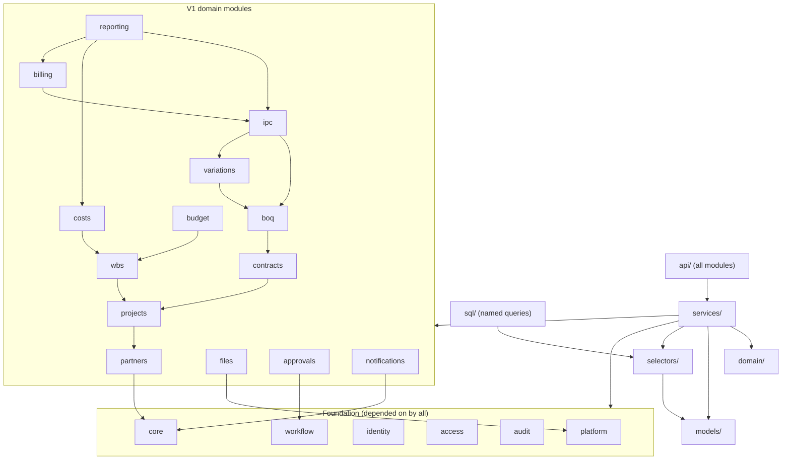

# C. Application / Module Architecture

V1 is a **modular monolith**: one deployable Django project, one database, hard internal module
boundaries enforced by tests and import-linting. Microservices are rejected because the domain is
transactionally entangled (a single IPC certification touches BOQ, contract value, retention, VAT,
approvals, audit and storage) and the team is small; the cost of distributed transactions and
distributed tracing would be paid for nothing.

---

## 1. Layering (per module, strictly one-directional)

```
api/            DRF viewsets, serializers, request/response DTOs, permission classes
  │  (validates shape & types; never business rules)
services/       use cases: atomic units of business operation, one per user intent
  │  (owns the transaction boundary; calls authorization; emits audit + outbox)
domain/         pure business logic: calculations, state machines, invariants, value objects
  │  (no Django, no ORM, no I/O → unit-testable in milliseconds)
selectors/      read models: queries, aggregation, dashboards, exports
  │  (explicitly tenant-scoped; may read materialized views)
models/         ORM models, DB constraint declarations, queryset helpers
  └─ never imported by domain/
```

Rules:

- **`api/` may not compute money.** No arithmetic on financial fields in a serializer.
- **`services/` are the only writers.** Ad-hoc `Model.save()` in a view is forbidden by review
  checklist and by a lint rule on the `models` import surface in `api/`.
- **`domain/` is pure and framework-free.** If a rule can be tested without a database, it must be.
- **`selectors/` are read-only** and must take an explicit tenant context argument.
- Cross-module calls go **service → service** (public functions only), never `models/` of another
  module. Direct ORM joins across modules are allowed only inside `selectors/` for reporting.

---

## 2. Module map

| Module | Owns | Key services | Phase |
|---|---|---|---|
| `core` | Company/tenant, Branch, settings, reference data, currency, numbering series, tax rates, feature flags | `provision_company`, `update_company_settings`, `allocate_number` | 1 |
| `identity` | User, Membership, Invitation, Session, MFA, password reset | `invite_user`, `activate_membership`, `authenticate`, `revoke_sessions` | 1 |
| `access` | Role, Permission, RolePermission, MembershipRole, ProjectMember, ProjectAccessRequest, delegation | `grant_project_access`, `revoke_project_access`, `resolve_principal` | 1–2 |
| `audit` | AuditLog, change capture, hash chain, checkpoints | `record_audit`, `verify_chain`, `export_checkpoint` | 1 |
| `files` | Document, DocumentVersion, DocumentLink, upload sessions, AV/scan state | `create_upload`, `finalize_upload`, `authorize_download`, `link_document` | 2 |
| `partners` | Client, Supplier, Subcontractor, contacts, legal identifiers | `upsert_partner`, `archive_partner` | 2 |
| `projects` | Project, ProjectMember, project settings | `create_project`, `transition_project_status` | 2 |
| `contracts` | Contract, ContractValueLedger, ContractLine/advance/retention terms | `create_contract`, `post_contract_value_entry`, `close_contract` | 3 |
| `boq` | BOQ, BOQSection, BOQItem, revisions, Excel import pipeline | `import_boq`, `commit_import`, `revise_boq_item` | 3 |
| `wbs` | WBS node tree, CostCode tree (same engine, two trees) | `create_node`, `move_node`, `deactivate_node` | 3 |
| `budget` | Budget, BudgetLine, budget versions/transfers | `create_budget_version`, `submit_budget`, `approve_budget`, `transfer_budget` | 4 |
| `variations` | VariationOrder, VO lines, approval linkage | `submit_vo`, `approve_vo`, `reject_vo`, `cancel_vo` | 4 |
| `ipc` | IPC, IPCLine, certification, retention/advance/deductions, generated certificates | `prepare_ipc`, `certify_ipc`, `post_ipc`, `reverse_ipc` | 5 |
| `costs` | Expense, cost allocation, commitments (schema-ready), cost adjustments | `record_expense`, `post_expense`, `reverse_expense` | 5 |
| `billing` | Collection, allocation to IPC/contract, aging | `record_collection`, `allocate_collection`, `reverse_collection` | 5 |
| `approvals` | ApprovalWorkflow, ApprovalWorkflowStep, ApprovalRequest, ApprovalAction | `submit_for_approval`, `decide`, `escalate` | 3 |
| `workflow` (generic) | StatusTransition registry shared by all state machines | `transition(document, action, actor)` | 3 |
| `reporting` | Materialized views, dashboards, profitability, curated reports, export jobs | `project_financial_position`, `company_dashboard`, `export_report` | 6 |
| `notifications` | Outbox → email/in-app notification | `enqueue`, `dispatch` | 6 |
| `platform` | Cross-cutting: PrincipalContext, tenant transaction, permission cache, idempotency, errors, health, config | — | 1 |

---

## 3. Module dependency rules



**Forbidden dependencies (enforced by an import-linter contract in CI):**

- `reporting` ← no module may depend on `reporting` (it must be a leaf).
- Any module → `api`.
- `domain` → Django/ORM.
- `boq` cannot write IPC or contract tables; `ipc` cannot write BOQ tables. It reads BOQ *snapshots*
  through `boq.selectors` and writes only its own tables.
- `costs` and `billing` never write `ipc`; postings flow the other way.
- Cycles between V1 modules are a build failure.

---

## 4. The three cross-cutting spines

### 4.1 Principal / tenant context (`platform`)

Built once per request by middleware, then carried explicitly (never via a global that can leak
between requests or threads):

```text
PrincipalContext
  user_id                : UUID
  session_id             : UUID
  membership_id          : UUID
  company_id             : UUID        # the ONLY tenant authority for this request
  branch_ids             : tuple[UUID] # for branch-scoped roles
  is_platform_operator   : bool        # break-glass, mandates reason + audit
  permissions            : frozenset[str]        # company-scoped
  project_scopes         : dict[UUID, frozenset[str]]   # project_id -> project permissions
  request_id, ip, user_agent, auth_level (aal1|aal2)
```

Enforcement helpers used by every service:

| Helper | Meaning |
|---|---|
| `require("ipc.certify")` | company-scoped permission, else 403 |
| `require_project(project_id, "boq.edit")` | project-scoped permission; absence ⇒ **404** |
| `scope(queryset)` | adds `company_id = ctx.company_id` **and** project-scope filter; defence in depth |
| `deny_platform(ctx)` | platform operators cannot read tenant financial data without an audited elevation grant |

### 4.2 Transaction + tenant GUC

```text
@tenant_atomic(require_project=None)
  ├─ open transaction.atomic()
  ├─ SELECT set_config('app.current_company_id', <uuid>, true)   -- LOCAL to tx
  ├─ optionally set_config('app.current_project_ids', ...)
  ├─ run service body
  └─ commit  (audit rows + outbox events written in the same tx)
```

`SET LOCAL` (via `set_config(..., true)`) is mandatory so pooled connections cannot leak tenant
context between requests. Guard triggers raise if a financial table is touched with no context.

### 4.3 Idempotency + concurrency

- **Idempotency**: state-changing POSTs accept an `Idempotency-Key`; the key, request hash and
  response are stored per company for 24h; replay returns the original response instead of
  double-posting a collection or an expense.
- **Optimistic concurrency**: mutable documents carry `version` (int) and `lock_version`; updates
  must send `If-Match`-style `version` and mismatches return 409 with a diff hint.
- **Pessimistic locking**: certification paths take `SELECT … FOR UPDATE` / advisory locks
  ([I §6](I-financial-architecture.md)).

---

## 5. API conventions

| Aspect | Convention |
|---|---|
| Style | REST/JSON over `/api/v1/…`; URL-versioned; no verbs in paths except explicit transition endpoints (`POST /ipcs/{id}/certify`) |
| Tenancy | `company_id` never appears in a body as an authority. Multi-company users call `/api/v1/companies/{id}/…` only for ids present in their session-validated memberships; the server re-validates every time |
| IDs | UUIDv7 primary keys (non-enumerable, index-friendly); sequential "document numbers" are separate, per-company, display-only |
| Money in JSON | **strings** (`"125000.5000"`), never JSON numbers, to eliminate float parsing on both ends; quantities likewise decimal strings |
| Payload totals | Server ignores/rejects client-sent totals and derived cumulative values (schema excludes them) |
| Dates | `YYYY-MM-DD` for dates; RFC3339 UTC for instants; display timezone applied client-side + in PDFs |
| Errors | RFC 9457 problem details: `{type, title, status, code, detail, request_id, field_errors[]}`; codes are stable, translatable identifiers (`ipc.already_certified`) |
| Pagination | Cursor-based for lists; `limit` capped (default 25, max 200) |
| Filtering/sorting | Allowlisted fields only; no arbitrary ordering by nested paths; no raw `Q`/`order_by(user_input)` |
| Bulk | Explicit bulk endpoints with row-level results and all-or-nothing transaction semantics where the domain requires it |
| Rate limits | Per user + per IP on auth, uploads, imports, PDF generation and exports |
| Caching | `ETag` on read endpoints; cache keys **always** prefixed by `company_id` |
| OpenAPI | Generated schema committed; drift check in CI; used to generate the TS client types |

---

## 6. Background jobs interface (`N`)

Services never call Celery directly. They write an **outbox row in the same transaction**; a
dispatcher publishes it after commit; task handlers are idempotent and carry
`{company_id, request_id, actor_id, correlation_id}` in their envelope so worker-side authorization
and auditing behave exactly like request-side ([N §3](N-background-jobs.md)).

---

## 7. Non-functional targets (V1 sizing)

| Metric | Target |
|---|---|
| Tenant size assumption | ≤ 200 concurrent users per company; ≤ 50 projects; ≤ 20k BOQ items/project; ≤ 10k IPC lines/project |
| p95 read latency | ≤ 400 ms for lists/dashboards (materialized views behind dashboards) |
| p95 write latency | ≤ 600 ms for line entry; certification ≤ 2 s (single document) |
| BOQ import | 20k rows validated + preview ≤ 60 s, committed atomically |
| PDF generation | ≤ 5 s per certificate, asynchronous with progress UI |
| Uptime objective | 99.5% best-effort on single VPS, with honest RTO/RPO in [O](O-backup-disaster-recovery.md) |

---

## 8. What V1 deliberately does not build

- No plugin/extension runtime, no user-defined formulas, no scripting, no raw SQL reporting.
- No realtime websockets in V1 (approval/notification via polling + email); revisit only if
  collaboration on IPC entry becomes a proven need.
- No mobile app; responsive web with large-grid usability as the constraint, not touch-first design.

## 9. Frontend architecture (scaffold only — no implementation in Phase 0)

- Feature-oriented folders mirroring the modules above; shared `AuthorizationProvider` that hides
  actions the API would reject — **explicitly documented as UX-only, never a control**
  ([G §2](G-authorization-rbac.md)).
- A single typed API client generated from OpenAPI; money always handled as `string`/`Decimal`
  wrapper, never `number`.
- `dir` and locale driven by the user's preference; all layout uses logical CSS properties;
  component library audited for RTL correctness before adoption ([S §8](S-testing-strategy.md)).
