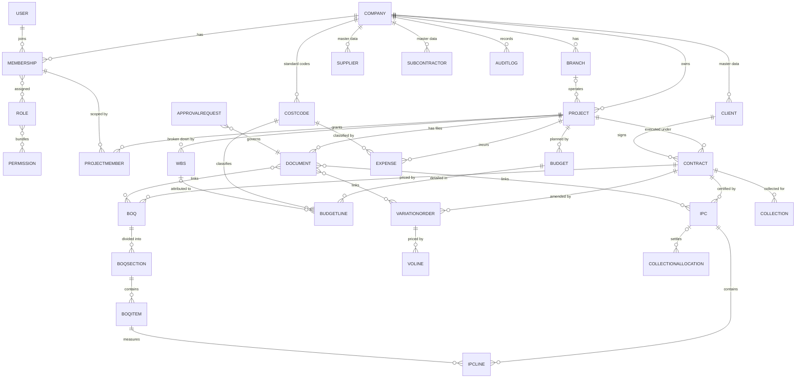

# D. V1 Domain Model

This section defines the business language, the aggregates, and the invariants. It is the reference
for every later section. Nothing here is implementation code.

---

## 1. Ubiquitous language (English / Arabic)

| Concept | English term used in code | Arabic (product) | Definition / rule |
|---|---|---|---|
| Tenant | `Company` | الشركة (المنشأة) | The legal entity subscribing to the SaaS. Tenant boundary. |
| Branch | `Branch` | الفرع | Operating subdivision of a company (region/office). Optional in V1 usage, mandatory in data model. |
| User | `User` | المستخدم | A natural person identity. **Global**, not tenant-owned. |
| Membership | `Membership` | عضوية المستخدم | Links a User to a Company, with status, branch scope and roles. |
| Role | `Role` | الدور | Named, company-owned bundle of permissions (system templates + custom). |
| Permission | `Permission` | الصلاحية | Atomic, code-defined capability (`ipc.certify`, `boq.edit`). |
| Project | `Project` | المشروع | A construction project belonging to a company, optionally to a branch. |
| ProjectMember | `ProjectMember` | عضو المشروع | Grants a membership explicit project access + project-scoped permissions. |
| Client | `Client` | العميل (المالك) | Party paying the contractor. |
| Supplier | `Supplier` | المورد | Party selling materials/services to the contractor. |
| Subcontractor | `Subcontractor` | المقاول الفرعي | Party performing work under the contractor *(V1: party master only, no subcontract module)*. |
| Contract | `Contract` | العقد | The agreement being executed for a project, with its value, retention and advance terms. |
| BOQ | `BOQ` | جدول الكميات | Priced bill of quantities: **revenue** structure of the project. |
| BOQSection | `BOQSection` | قسم / بند رئيسي | Hierarchical grouping of BOQ items (Division/Section). |
| BOQItem | `BOQItem` | بند | A priced line: code, description, unit, qty, rate, amount. |
| WBS | `WBS` (node) | هيكل تجزئة العمل | Project **execution/delivery** breakdown, a tree; not priced by itself. |
| CostCode | `CostCode` | رمز التكلفة | Company standard cost classification tree (CBS). |
| Budget | `Budget` | الموازنة | Approved spending plan in **cost** space. |
| BudgetLine | `BudgetLine` | بند الموازنة | One budgeted amount keyed by cost code (+ optional WBS node / BOQ link). |
| VariationOrder | `VariationOrder` (VO) | أمر تغيير | Instructed/requested scope or price change to the contract. Only `approved` ones change contract value. |
| IPC | `IPC` | المستخلص | Client Interim Payment Certificate / progress certificate for a period. |
| IPCLine | `IPCLine` | بند المستخلص | A certified revenue line for a BOQ item in a period. |
| Expense | `Expense` | المصروف | A cost incurred, posted to cost code (and WBS and/or BOQ link). |
| Collection | `Collection` | التحصيل | Money received from the client, allocated to contract/IPC. |
| Document | `Document` | المستند | A **file** (versioned, private) or a generated PDF, plus its metadata and links. |
| Approval | `ApprovalRequest` / `ApprovalAction` | الموافقة | Workflow instance + immutable decision records. |
| AuditLog | `AuditLog` | سجل التدقيق | Append-only, hash-chained record of sensitive actions. |

### Vocabulary disambiguation (these must never be conflated)

| Pair | Distinction |
|---|---|
| Revenue BOQ vs Cost Budget | BOQ prices what the **client pays** (earned value / revenue). Budget plans what the **contractor spends**. They are different structures with different units of analysis. |
| WBS vs CostCode | WBS = where/when work is executed in the project's breakdown (project-specific tree). CostCode = accounting classification of cost (company-wide standard tree). A cost has both; a budget line is keyed by cost code and optionally attributed to a WBS node. |
| WBS vs BOQ | BOQ is the priced baseline; WBS is the delivery structure. Linkage is optional and queryable, never a mandatory 1:1. |
| Budget vs Committed vs Actual vs Forecast | Intent vs legally-encumbered vs incurred vs expected-at-completion. See [I §3](I-financial-architecture.md). |
| Certified vs Invoiced vs Collected | Work approved by the client vs amount billed vs cash received. Three separate states; dashboards must show all three (DSO lives between invoiced and collected). |
| IPC "Previous" | The certified cumulative at the **period cutoff**, derived from history — never "the last row in the table" and never client-supplied. |
| Retention vs Advance recovery | Retention is withheld from certified work and released per contract rules; advance recovery recovers the mobilisation payment. Both reduce net payable, tracked separately. |
| Variation "Approved" | Client-approved with a documented basis. `submitted`/`under_review`/`rejected` VOs **do not** increase contract value. |

---

## 2. Aggregate boundaries

Aggregates are the transaction consistency units. Cross-aggregate change happens through services
and, where a document needs a stable picture of another aggregate, through **snapshots**.

| Aggregate root | Members | Consistency rule |
|---|---|---|
| **Company** | Company, Branch, CompanySetting, NumberSeries, TaxRate | Configuration changes are audited; tax rates are effective-dated, never retroactive-edited |
| **Membership** | Membership, MembershipRole, (session/MFA state) | Role changes are immediate and revoke dependent caches/permissions |
| **Project** | Project, ProjectMember, ProjectSetting | Project scope is the outer boundary for all project data |
| **Contract** | Contract, ContractValueEntry (ledger), ContractMilestone | `current_value` = Σ posted ledger entries, recomputed under lock |
| **BOQ** | BOQ, BOQSection, BOQItem, BOQRevision (header-level versioning) | Items mutate only while BOQ is `draft`; afterwards a revision workflow |
| **WBS** / **CostCode** | trees | Nodes are soft-deleted/deactivated, never hard-deleted while referenced |
| **Budget** | Budget, BudgetLine (version) | One `approved` version per project per scope at a time; changes create a new version or a transfer |
| **VariationOrder** | VariationOrder, VOLine, VOApprovalLink | Amount = Σ lines; contract value impact only on approval, post-lock |
| **IPC** | IPC, IPCLine, IPCDeduction, IPCCertificationSnapshot | Certification is atomic, locks the project, snapshots rates/retention/advance/previous cumulative |
| **Expense** | Expense, ExpenseAllocation | Posted expenses are immutable; corrections via reversal + replacement |
| **Collection** | Collection, CollectionAllocation | Allocations cannot exceed the collection amount nor the outstanding receivable |
| **Document** | Document, DocumentVersion | Versions are append-only; the current version is a pointer, old versions retained |
| **Approval** | ApprovalRequest, ApprovalAction | Steps are snapshotted at submit time; decisions are immutable |

---

## 3. Invariants (must hold at all times)

Numbered for direct use in tests ([S §6](S-testing-strategy.md)) and constraints ([E §5](E-database-design.md)).

### Tenancy & identity
- **INV-01** Every tenant-owned row has a non-null `company_id`.
- **INV-02** No row may reference a parent row belonging to a different `company_id`
  (enforced by composite FKs, [ADR-0018](adr/ADR-0018-composite-foreign-keys.md)).
- **INV-03** A User may hold Memberships in several companies; roles are always scoped to a
  Membership, never to a User globally.
- **INV-04** A ProjectMember/Membership row cannot be created for a project outside the
  membership's company (composite FK).
- **INV-05** Revoking a membership or role takes effect within the session freshness window and
  invalidates cached project scopes.

### Commercial documents
- **INV-10** `BOQItem.amount = round(qty × rate, 2)`; `BOQ.total = Σ` section subtotals; every level
  recomputed server-side.
- **INV-11** BOQ items are editable only while the BOQ is `draft`; afterwards changes require a
  revision or a variation order.
- **INV-12** A BOQ section cannot be moved under one of its own descendants (cycle-free tree).
- **INV-13** `Revised Contract Value = Original Contract Value + Σ approved variation amounts
  (signed) + Σ approved contract value ledger entries`, computed from the ledger under lock.
- **INV-14** `submitted | under_review | rejected | cancelled` VOs contribute **zero** to contract
  value. A VO may only be `approved` once (immutable approval evidence).
- **INV-15** A VO's contract-value effect is posted to the ledger exactly once (unique constraint on
  `(company_id, source_type, source_id, entry_type)`).

### IPC (client certificates)
- **INV-20** For each `(ipc, boq_item)`, `previous_qty + current_qty = cumulative_qty`, and
  `previous_qty` equals the authoritative certified cumulative at `period_from` — **never** a value
  supplied by the client ([I §6](I-financial-architecture.md)).
- **INV-21** `cumulative_qty ≤ boq_item.qty + approved_vo_qty_for_that_item` (over-certification is
  blocked unless the contract explicitly allows it — company flag, default **block**).
- **INV-22** `line_amount = round(current_qty × certified_rate, 2)` using the **snapshotted** rate.
- **INV-23** Retention = `round(Σ eligible line amounts × retention_pct / 100, 2)` with the
  percentage/limits snapshotted from the contract at certification.
- **INV-24** Advance recovery = `min(remaining_advance, certified_gross × recovery_pct/100)`
  with the contract's recovery schedule; recovered amount tracked cumulatively.
- **INV-25** `net_payable = gross_certified − retention_withheld − advance_recovered −
  other_deductions + approved_additions`, computed by the server.
- **INV-26** An IPC's period may not overlap another **non-cancelled** IPC of the same contract.
- **INV-27** An IPC may be certified only if its BOQ baseline is `approved` and the contract is
  `active`.
- **INV-28** Certification is serialized per contract: no two simultaneous certifications may
  compute the same `previous` values.
- **INV-29** A `certified`/`posted` IPC is immutable except for lifecycle transitions
  (`certified → approved → posted → partially_paid → paid → closed`) and reversal.

### Cost, collections
- **INV-30** A posted Expense cannot be edited; it is reversed and re-recorded.
- **INV-31** Expense cost code, WBS node and BOQ link (when provided) must belong to the same
  project and company.
- **INV-32** Σ `CollectionAllocation.amount` ≤ `Collection.amount` and ≤ outstanding receivable for
  the referenced IPC/contract.
- **INV-33** Collections never modify IPC certified amounts; they only update receivable status.
- **INV-34** `committed_cost` (V1: from recorded commitments/approved non-labour obligations where
  captured, else 0) never silently overwrites actual cost; the four cost concepts are stored and
  reported separately ([I §3](I-financial-architecture.md)).

### Workflow, audit, files
- **INV-40** Every document status change goes through the registered transition table for its type.
- **INV-41** Approving a document requires an actor who is *not* the submitter where segregation of
  duties is configured (default: required for VO/IPC/Budget).
- **INV-42** Every sensitive action produces an audit row with actor, company, entity, before/after,
  request id — written in the same transaction as the change.
- **INV-43** Audit rows cannot be updated or deleted by any application role.
- **INV-44** A file is downloadable only after a server-side authorization check against its owning
  entity's scope; download URLs are short-lived and non-shareable across tenants.
- **INV-45** Deleting a document does not delete its history: versions/audit and (where the record is
  financially referenced) the file is retained or soft-deleted, never hard-purged in V1.

### Financial arithmetic
- **INV-50** All monetary values are exact decimals with `numeric(20,4)` storage and a fixed rounding
  policy; no floating point anywhere ([ADR-0004](adr/ADR-0004-money-representation-and-rounding.md)).
- **INV-51** Totals are DB/service-derived; client-sent totals are ignored/rejected.
- **INV-52** Reports recompute from documents using snapshotted rates, not from current
  configuration.
- **INV-53** Σ allocations/Σ net payables are allowed to differ from a header total only if the
  header is *defined* as the sum of lines; headers that intend to carry a rounded value store it
  explicitly with a documented reconciliation field.

---

## 4. Conceptual model

*(Physical tables, columns, constraints and indexes: [`E-database-design.md`](E-database-design.md)
and [`db/`](db). Full ERD with cardinality notes: [`ERD.md`](ERD.md).)*

---

## 5. Relationship rules the model must express

| Relationship | Cardinality | Rule |
|---|---|---|
| Company → Branch | 1..n | A company must have ≥1 branch (created with the company; may be "Head Office") |
| Branch → Project | 0..n | A project may have no branch (company-wide) or exactly one |
| User ↔ Company via Membership | 0..n ↔ 0..n | Membership holds status (`invited/active/suspended/revoked`), branch scope, roles |
| Membership ↔ Role | n..n | Roles are company-owned; assignment is audited |
| Role ↔ Permission | n..n | Permissions are fixed codes from the catalogue; roles cannot invent permissions |
| Membership ↔ Project via ProjectMember | n..n | Grants `project_permissions` (subset of catalogue) + optional `is_project_admin` |
| `*_created_by` / `approved_by` | n..1 | Always references `users.id` (not `memberships.id`) for a stable global actor identity; company scoping is checked separately |
| Project → Contract | 1..n | A project may have several contracts over time; **one** `is_primary` active contract drives V1 dashboards |
| Contract → BOQ | 1..n | BOQs are versioned; exactly one `approved` is the measurement baseline at a time |
| BOQSection → BOQItem | 1..n | Items hang off sections, never off the BOQ root; section nesting via `parent_section_id` |
| Project → WBS | 1..n | Roots + children via `parent_id`; `path` materialized for queries |
| Company → CostCode | 1..n | Company-wide tree; project may *select* a subset via `project_cost_codes` (V1: selection is optional, tree is global) |
| Budget → BudgetLine | 1..n | Line requires `cost_code_id`; `wbs_node_id` and `boq_item_id` optional |
| Contract → VariationOrder | 1..n | Each VO optionally targets BOQ items via `variation_order_lines.boq_item_id` |
| Contract → IPC | 1..n | Sequential periods; `ipc_number` per company sequence |
| IPC → IPCLine | 1..n | One line per BOQ item measured in the period (unique per item) |
| BOQItem → Expense | 0..n | Optional linkage enabling earned-vs-spent analysis per item |
| Expense → WBS/CostCode | n..1 each | Both required or cost code required + WBS optional (see open decision D-10) |
| Client/Supplier/Subcontractor → Project | via link tables | A party master exists at company level; linking to projects is a separate, explicit table (prevents global master from implying access) |
| Document → any entity | many-to-many via `document_links` | Polymorphic-with-integrity link table (typed FK columns, one non-null per row) |
| Approval → Document | 1..1 active request | Only one active approval request per document; history retained |
| Any entity → AuditLog | 1..n | Audit rows are written for a *set* of audited tables, listed in [L §3](L-audit-logging.md) |

---

## 6. Tenant ownership classification (drives RLS decisions)

| Category | Entities | `company_id` present | RLS |
|---|---|---|---|
| Tenant-owned | every table listed by name in [E §12](E-database-design.md), except those below | yes | `ENABLE` + `FORCE`, policy `USING`/`WITH CHECK` = `company_id = current_setting('app.current_company_id')::uuid` |
| Global (platform) | `users`, `permissions`, `currencies`, `units_of_measure`, `regions`, `cities`, `schema_version` | no | no RLS; access through application roles with explicit joins |
| Company-configurable reference | `roles`, `tax_rates`, `number_series`, `approval_workflows` | yes | RLS as tenant-owned |
| Cross-tenant by design (V1: none) | — | — | V1 exposes no cross-tenant feature (no shared subcontractor network, no benchmarking). If added later it gets a separate, explicitly-reviewed view with `SECURITY DEFINER` and column projection only |

---

## 7. Numbering, currency and dates (domain rules)

- **Document numbers** are per-company, per-type, gap-free-enough sequences allocated from
  `number_series` inside the same transaction as the document insert (`SELECT … FOR UPDATE` on the
  series row). Format example: `IPC-2026-000317`. Displayed, never used as a primary key.
- **Currency** is on every financial document (`currency_code`), defaulting to the company's
  currency (`SAR`). V1 has **no FX conversion engine**; the columns exist so that a future multi-currency
  module is additive rather than a migration of historical data.
- **Dates**: `document_date` (business date, `date`), `period_from`/`period_to` (IPC measurement
  window, `date`), `posted_at`/`certified_at` (`timestamptz`). Business date drives ledgers and
  reporting; timestamps drive audit and SLA.
- **Periods** are half-open `[period_from, period_to)` for measurement windows to avoid double
  counting a boundary date; enforced by the no-overlap constraint.

---

## 8. Domain rules that exist because the product is a *financial* system

1. **Nothing financial is ever deleted.** Cancel/reverse/replace, with the original retained and
   linked to its reversal.
2. **Everything certified keeps its arithmetic inputs.** Snapshot: rate, retention %, advance
   recovery %, VAT rate basis points, previous cumulative quantity, and the BOQ revision used.
   This is what makes an audit six months later reproducible.
3. **Cash ≠ revenue.** Collections update receivables and cash position only; they never alter
   certified work or contract value.
4. **Approval evidence is data, not a boolean.** Who, when, in what step, with what comment, with
   which role, and whether it was delegated.
5. **The dashboard is a derived view.** Every KPI has a documented drill-down to source documents,
   and dashboards are recomputable from the record ([I §8](I-financial-architecture.md)).
