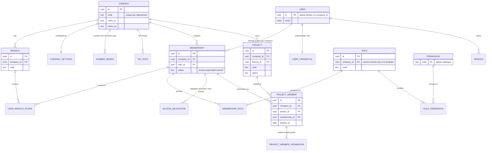
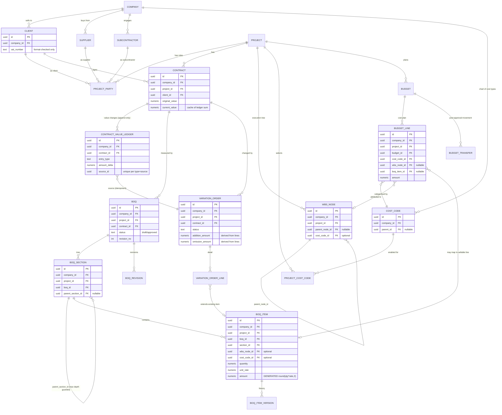
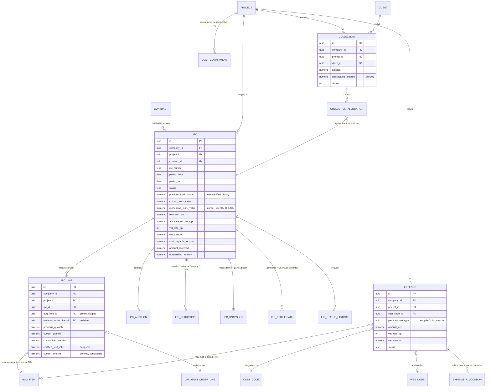
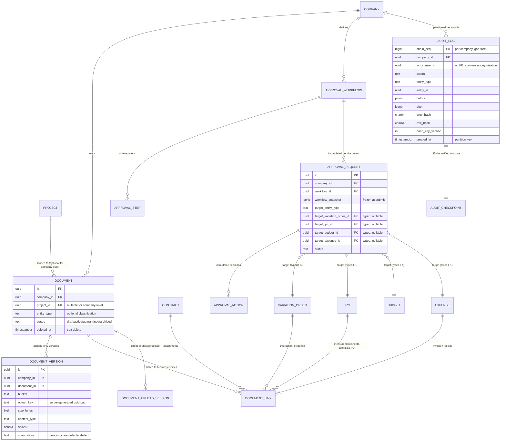

# ERD — Domain and Database Diagram

Companion to [D](D-domain-model.md) (business language and invariants) and [E](E-database-design.md)
(types, constraints, indexes). This file is the **relationship map**: what connects to what, with which
cardinality, and what enforces it. The normative DDL is in [`db/`](db).

Reading rules for every diagram below:

* every tenant-owned entity carries `company_id`, and every reference between tenant entities is a
  **composite foreign key** carrying it ([ADR-0018](adr/ADR-0018-composite-foreign-keys.md));
* project-owned parents expose `(company_id, project_id, id)` and their children carry all three
  ([ADR-0019](adr/ADR-0019-project-scoped-composite-foreign-keys.md));
* `AuditLog` rows are written for every audited table (drawn as one dashed relationship per group to
  keep the picture readable, not as 60 separate lines);
* soft-deleted master data (`deleted_at`) is intentionally omitted from the diagrams.

---

## 1. Tenancy, identity and access

Key points:

| Relationship | Cardinality | Enforcement |
|---|---|---|
| Company → Membership | 1..n | `uq_memberships_company_user` (a user has at most one membership per company) |
| User → Membership | 1..n (one per company) | global `users` table deliberately has **no** `company_id`; tenancy enters through membership |
| Role → Permission | n..n via `role_permissions` | permissions are a **global catalogue**; tenants compose roles, they cannot invent permission codes |
| Project → ProjectMember | 1..n | `project_members` carries `(company_id, project_id)` so a member cannot be attached to another tenant's project |
| Membership → Branch scope | 1..n | empty scope = all branches; non-empty scope = explicit restriction |

---

## 2. Commercial core: partners → project → contract → BOQ

Key points:

| Relationship | Cardinality | Enforcement / rule |
|---|---|---|
| Project → Contract | 1..n | contracts carry `(company_id, project_id)` → a contract cannot belong to another tenant's project |
| Contract → BOQ | 1..n (one approved at a time) | partial unique index: at most one `approved` BOQ per contract |
| BOQ → BOQSection → BOQItem | 1..n, 1..n | sections form a tree (`parent_section_id`, cycle-guarded trigger); items hang off sections, never off other items |
| BOQItem → VariationOrderLine | 1..n (optional) | an approved VO line **extends** the item's certifiable quantity ([K §4](K-boq-ipc-vo-design.md)) |
| VariationOrder → ContractValueLedger | 0..1 | unique `(company_id, source_type, source_id, entry_type)` makes posting idempotent |
| Budget ↔ WBS ↔ CostCode ↔ BOQItem | n..1 each | deliberately separate concepts; links are optional (except cost code) and every link is project-scoped |

---

## 3. Measurement and money: IPC ← VO/BOQ, then cost and cash

Key points:

| Relationship | Cardinality | Enforcement / rule |
|---|---|---|
| Contract → IPC | 1..n | non-overlapping, non-cancelled periods via an EXCLUDE constraint; sequential periods enforced in the certification service |
| IPC → IPCLine | 1..n | lines are frozen from certification; `Σ current_amount = header current_work_value` is an integrity metric |
| IPCLine → BOQItem | n..1 | composite FK `(company_id, project_id, boq_item_id)` → **another project's item is refused** (verified in Phase 0) |
| IPCLine → VariationOrderLine | n..1 (optional) | variation work is always traceable to the approved VO that authorised it |
| IPC → IPCSnapshot | 1..1 | written at certification; immutable; carries the payload hash and the terms used |
| CollectionAllocation → IPC | n..1 | `Σ allocations ≤ collection.amount` and `≤ IPC.outstanding_amount`, enforced under lock |
| Expense → WBS/CostCode | n..1 | cost code required; WBS and BOQ item optional → "unlinked cost" is reported, not hidden (open decision D-10) |

---

## 4. Documents, approvals and audit

Key points:

| Relationship | Cardinality | Enforcement / rule |
|---|---|---|
| Document → DocumentVersion | 1..n | append-only; the file itself is private object storage; only metadata lives in the database |
| Document → DocumentLink | 1..n | polymorphic **typed nullable FKs**, one real composite FK per target plus `CHECK (num_nonnulls(...) = 1)` — the pattern used wherever one table can point at several entity types |
| ApprovalWorkflow → ApprovalRequest | 1..n | the workflow definition is **snapshotted** onto the request so later template edits cannot change an in-flight approval |
| ApprovalRequest → ApprovalAction | 1..n | INSERT-only; each row records actor, role, step, comment, IP and request id |
| ApprovalRequest → target | exactly one of the 4 typed FKs | one open request per target is enforced by a partial unique index |
| AuditLog → AuditCheckpoint | windows | checkpoints record covered range, count, head hash, exported off-site |
| Any audited table → AuditLog | 1..n (dashed in reality) | row-change triggers on every audited table plus semantic events from services |

---

## 5. Cross-cutting relationship rules (the invariants the diagrams encode)

| # | Rule | Where enforced | Verified |
|---|---|---|---|
| 1 | No reference crosses a tenant | composite FKs `(company_id, …)` | Phase 0: `fk_contracts_client` refused a foreign client |
| 2 | No reference crosses a project for project-owned entities | composite FKs `(company_id, project_id, …)` | Phase 0: `fk_ipc_lines_boq_item` refused a foreign BOQ item |
| 3 | A polymorphic link has exactly one real parent | nullable typed FK per type + `num_nonnulls(...) = 1` + stored `entity_type` | `party_contacts`, `project_parties`, `document_links`, `approval_requests` |
| 4 | Money never leaves the database unrounded or the client in charge | generated line amounts + identity CHECKs + server-side recomputation | Phase 0: forged VAT rejected by `ck_ipcs_total_identity` |
| 5 | Value changes are append-only and idempotent | `contract_value_ledger` + unique source key | Phase 0: same ledger id returned twice |
| 6 | Documents and audit tables are append-only | grants + freeze triggers | Phase 0: `IPC_FROZEN`, `VO_FROZEN`, `permission denied` on `audit_logs` |
| 7 | Every tenant table is RLS-protected and fail-closed | `ENABLE`+`FORCE`+policy, runtime role without `BYPASSRLS` | Phase 0: 0 rows with no context, cross-tenant INSERT refused |
| 8 | Trees cannot become cycles | `app.forbid_tree_cycle(parent_column)` bound per tree table | Phase 0: WBS move under its own descendant raised `TREE_CYCLE` |

## 6. Text alternative (for readers who cannot render Mermaid)

Relationships in words, grouped as the diagrams are:

* **Company** owns branches, settings, number series, tax rates, roles, clients, suppliers,
  subcontractors, cost codes, projects and documents. **Users** are global identities that become part
  of a company through a **Membership**; a membership holds **Roles**, which bundle **Permissions**;
  a membership may also have branch scopes and delegations. **Project access** is separate: a
  **ProjectMember** row (per membership per project) plus optional project-member permissions.
* A **Project** belongs to a company (and optionally a branch) and to a **Client**. It has
  **Contracts**, one approved **BOQ** per contract (with **BOQSections** and **BOQItems**), a **WBS**
  tree, selected **CostCodes** and **Budgets** with **BudgetLines**.
* **VariationOrders** (with lines) change contract value through the append-only
  **ContractValueLedger**; only approved VOs post, exactly once.
* **IPCs** certify measured work per period with **IPCLines** that reference BOQ items (and, for
  variation work, VO lines), plus additions and deductions and an immutable **IPCSnapshot**;
  certification reads previous/cumulative values from certified history under lock.
* **Expenses** capture cost against cost codes (optionally WBS/BOQ), **Collections** capture cash and
  are allocated to IPCs through **CollectionAllocations** under limit checks.
* **Documents** carry versions (private object storage) and can be linked to any business entity;
  **Approvals** are workflow definitions with steps and per-document requests with immutable actions.
* **AuditLog** is the partitioned, hash-chained record of every audited change and semantic event,
  with checkpoints proving the chain off-site.
