# Final Architecture Review — Phase 0 Gate (before approval)

**Reviewed artifact:** the **committed** specification at `4ccfdd8` (working tree clean, verified with
`git status`). No schema file was modified to produce this review.
**Method:** every claim below was executed against a real **PostgreSQL 16.2** instance with the schema
loaded, using the **runtime role `app_rw`** (not a superuser) and a two-tenant fixture (Alpha/Beta)
seeded *through the runtime role under tenant context*. Where a statement is a design intent and not
yet an executed fact, it is labelled **[not yet executed]**.
**Purpose:** reduce unnecessary complexity and prove the security-critical decisions. This review
recommends changes; it applies none. Where a change is proposed it is flagged **PROPOSED**, never
silently applied.

---

## 0. Baseline facts (measured, not estimated)

| Fact | Measured value |
|---|---|
| Base tables created by the spec | **84** (83 ordinary + `audit_logs` partitioned parent) + **4** live partitions |
| Tables carrying `company_id` | **74** (70 tenant tables + 4 partitions) |
| Relations with RLS **enabled + forced** | **75** (70 tenant + 4 partitions + the `companies` root) |
| Global tables without `company_id` | **13** (`schema_version`, `currencies`, `units_of_measure`, `regions`, `cities`, `users`, `user_credentials`, `user_mfa_totp`, `user_mfa_recovery_codes`, `permissions`, `sessions`, `login_attempts`, `password_reset_tokens`) |
| Tables the runtime role may `DELETE` from | **13** (all operational/join rows — no business document) |
| Append-only tables denied `UPDATE`/`DELETE` at the grant layer | `audit_logs`, `audit_checkpoints`, `contract_value_ledger`, `ipc_snapshots`, `variation_order_approvals`, `approval_actions`, `ipc_status_history` (+ `DELETE` denied on every other business table) |
| Money columns of type `numeric(20,4)` | **0** — money is `numeric(20,2)`; 4-dp precision lives on **rates** (`numeric(18,4)`) |
| CI schema-lint assertions | 6, executable, proven to fail under deliberate sabotage |

**One honesty note up front:** the two most serious findings below (F-01, F-02) are **privilege
defects in `db/14_roles_and_grants.sql`**, not in the table design. They are reproducible in one query
and are exactly the class of defect a review is for.

---

## 1. Database complexity review — every table classified

This is a **keep/remove classification by purpose**, which is *not* the same partition as the
isolation split in [E §12](E-database-design.md). Two different 70s exist and must not be confused:

* the **isolation split** = 70 tenant tables (carry `company_id`, RLS forced) + 13 global tables + the `companies` root;
* the **keep/remove buckets below** = 70 product tables + 10 infrastructure tables + 1 future + 3 deferrable.

They overlap in opposite directions: `sessions` is *global* but **V1 required**, while
`document_upload_sessions`, `job_outbox`, `job_idempotency_keys`, `notifications` and
`notification_preferences` are *tenant-owned* yet classified as infrastructure, not product.

Buckets are mutually exclusive and exhaustive over all **84** created tables (arithmetic verified by
script against the committed files):

| Bucket | Count |
|---|---|
| **V1 required (product domains)** | **70** |
| **Infrastructure / security required** | **10** |
| **Future module (schema present, no V1 writer)** | **1** |
| **Can be removed / deferred** | **3** |

### 1.1 V1 required (70) — why each group must exist

| Group | Tables | Why it must exist in V1 (not "nice to have") |
|---|---|---|
| Tenancy root | `companies`, `company_settings`, `branches`, `number_series`, `tax_rates` | The tenant itself; per-company numbering (documents must be numbered serially per company); **effective-dated VAT** is required for reproducible historical certificates |
| Identity & access | `users`, `user_credentials`, `memberships`, `membership_invitations`, `roles`, `permissions`, `role_permissions`, `membership_roles`, `project_members`, `project_member_permissions`, `user_branch_scopes`, `access_delegations` | Requirement: users, roles, permissions, **project-level access** (V1 core list). `users` must be global (one person, several companies). Credentials are separated from identity so a password change does not touch the business record. Invitations exist because onboarding is invite-only (D-01) — no self-service tenant creation |
| Partners | `clients`, `suppliers`, `subcontractors`, `party_contacts`, `project_parties` | V1 core list names all three partner types; contracts cannot exist without a client; expenses/collections reference suppliers and clients; a partner held by several projects needs role linkage (`project_parties`) |
| Projects | `projects`, `project_settings`, `project_status_history` | V1 core list. Status history is the project-level lifecycle record shown in the UI (the audit trail is permission-gated and cannot serve as the product timeline) |
| Contract & value | `contracts`, `contract_value_ledger` | V1 core list + the *only* place the rule "RCV = original + approved VOs" is enforced with history ([ADR-0005](adr/ADR-0005-contract-value-ledger.md)) |
| BOQ | `boqs`, `boq_sections`, `boq_items`, `boq_item_versions`, `boq_revisions` | V1 core list. Sections/items are the measurement baseline; versions/revisions exist because a BOQ legitimately changes and certified IPCs must stay valid |
| WBS / cost codes / budget | `wbs_nodes`, `cost_codes`, `project_cost_codes`, `budgets`, `budget_lines`, `budget_transfers` | V1 core list requires WBS, Cost Codes, Budgets as **separate** concepts; `project_cost_codes` is what makes "this cost code applies to this project" enforceable; transfers are the approved-only way to move budget after approval |
| Imports | `import_batches`, `import_rows`, `import_validation_issues` | The mandated transactional Excel import flow (upload → validate → preview → confirm → atomic commit) *is* these three tables: staging, per-row raw+normalised values, and bilingual issues. Without them the flow cannot be transactional or evidenced |
| Variations | `variation_orders`, `variation_order_lines` | V1 core list; totals are derived from lines by the database, so a header cannot disagree with its lines |
| IPC | `ipcs`, `ipc_lines`, `ipc_deductions`, `ipc_additions`, `ipc_snapshots`, `ipc_certificates`, `ipc_status_history` | V1 core list. Deductions/additions are separate from lines because retention, advance recovery, penalties and claims are *not* measured work; the snapshot is what makes a 2026 certificate reproducible in 2029; certificates are the generated bilingual PDFs |
| Cost & cash | `expenses`, `expense_allocations`, `expense_status_history`, `collections`, `collection_allocations` | V1 core list (Project Expenses, Collections). Allocations are required because one invoice can legitimately split across cost codes/projects, and a collection can settle several certificates |
| Approvals | `approval_workflows`, `approval_workflow_steps`, `approval_requests`, `approval_actions` | V1 core list; the workflow snapshot at submit is what makes an in-flight approval immune to template edits; actions are the append-only decision evidence |
| Documents | `documents`, `document_versions`, `document_links` | V1 core list; versions are append-only because a filed document must not be quietly replaced; links attach evidence to any entity |
| Audit | `audit_logs`, `audit_checkpoints` | Requirement 17 + tamper-evidence ([ADR-0009](adr/ADR-0009-append-only-hash-chained-audit.md)); checkpoints are what make the chain meaningful against a privileged actor |
| Reporting | `project_forecast_overrides` | "Expected profitability" is a headline requirement; a human override of forecast cost must be recorded **with author and reason**, otherwise the KPI is unexplainable |
| Reference data | `currencies`, `units_of_measure`, `regions`, `cities`, `schema_version` | SAR default currency, Arabic/English units, Saudi regions/cities for addresses; `schema_version` is deployment metadata |

### 1.2 Infrastructure / security required (10)

| Table | Necessary because |
|---|---|
| `sessions` | Server-side revocation, device list, idle/absolute expiry, company switching (opaque sessions, not JWTs) |
| `login_attempts` | Brute-force telemetry and lockout evidence |
| `password_reset_tokens` | Single-use, hash-only, TTL-bounded resets |
| `user_mfa_totp`, `user_mfa_recovery_codes` | MFA is mandatory for privileged roles; recovery codes must be hashed and single-use |
| `document_upload_sessions` | The presigned direct-to-storage upload flow: the session row is the *only* record tying a staged object to a tenant, size, type and uploader before a version exists |
| `job_outbox`, `job_idempotency_keys` | Transactional outbox (no lost jobs on crash) and replay protection for financial API writes |
| `notifications`, `notification_preferences` | Workflow needs (approval requested, IPC certified, import failed, overdue receivable) with per-user channels |

Five of these ten (`document_upload_sessions`, `job_outbox`, `job_idempotency_keys`, `notifications`,
`notification_preferences`) do carry `company_id` and RLS — they are tenant-owned because their rows
belong to a tenant, even though they serve the platform rather than a business domain. The other five
(`sessions`, `login_attempts`, `password_reset_tokens`, `user_mfa_totp`, `user_mfa_recovery_codes`)
are deliberately **global and company-less**: authentication happens before a company context exists
(a user may belong to several companies and chooses one after login).

### 1.3 Future module (1)

| Table | Status | Honest assessment |
|---|---|---|
| `cost_commitments` | Present, **no V1 writer** — procurement/subcontract awards are out of scope | Kept because [I §3](I-financial-architecture.md)'s four-cost model and the dashboard's "committed cost" line read it. Reporting shows **0** and labels it. **Alternative:** drop it in V1 and remove the committed-cost field from the reporting views; adding it back later is additive. Recommendation: **keep** (one empty table, zero runtime cost) — but this is a legitimate simplification the owner may prefer |

### 1.4 Can be removed / deferred (3) — with reasoning that is *not* "fewer tables"

| Table | Recommendation | Reason |
|---|---|---|
| `variation_order_approvals` | **Remove in V1 (de-duplication)** | It duplicates the generic approval evidence (`approval_requests` + `approval_actions`) for one entity type: same decision, same actor, same comment, same request id. Two append-only sources of approval truth for VOs is a consistency hazard with no benefit. Its columns would be a *view* over `approval_actions` if a VO-shaped report is wanted. Removal is trivial: `DROP TABLE` + remove the RLS entry + remove its grant/revoke lines. **Nothing references it** (verified: only its definition, the RLS list and the grants) |
| `import_column_mappings` | **Defer** | Saved Excel column-mapping templates are a convenience; nothing references the table (verified). V1 import can match headers deterministically. Deferring removes a table whose UI does not exist yet |
| `project_milestones` | **Defer (or keep empty)** | Not in the V1 required-entity list. Milestones only earn their place with milestone billing or a milestone progress report; until then they are an unused form. If the pilot tenant uses milestone-linked payments, keep it and build it; otherwise defer |

### 1.5 Where the design is genuinely heavy (and whether that is justified)

| Observation | Verdict |
|---|---|
| **Widest tables (measured): `ipcs` 67 columns, `expenses` 51, `variation_orders` 41, `import_batches` 37, `contracts` 35, `ipc_lines` 31** | **Justified, keep.** `ipcs` is 5 quantity/cost families × (previous / cumulative / current) + generated `current_*` columns + lifecycle evidence stamps + snapshot/version wiring. The alternative (derive previous/cumulative at read time) is exactly the design that lets a report disagree with a signed certificate ([ADR-0007](adr/ADR-0007-ipc-derived-cumulative-and-locking.md)). `expenses` carries payee, VAT, withholding, payment and recovery evidence in one auditable row; `variation_orders` carries the value effect, the approval state and the posting link; `import_batches` is the evidence record for a mandated flow. The polymorphic tables are guarded by a `num_nonnulls(...) = 1` CHECK (quoted above), so "exactly one target" is a database rule, not a convention |
| `document_links` (20 columns; `ck_document_links_exactly_one` = `num_nonnulls(...) = 1` over **13 typed nullable targets** — `projects`, `contracts`, `boqs`, `boq_items`, `ipcs`, `variation_orders`, `expenses`, `collections`, `clients`, `suppliers`, `subcontractors`, `import_batches`, `approval_requests` — plus parent and actor) | **Justified.** Verifying every link against the real parent is what stops a document being attached to another tenant's entity. The alternative (a `(target_type, target_id)` pair with no FK) trades 13 nullable columns for the loss of referential integrity — the wrong trade in a financial system |
| Three per-document status-history tables (`ipc_status_history`, `expense_status_history`, `project_status_history`) | **Keep `ipc_status_history`** (financial, append-only, part of the certified evidence). The other two are the weakest of the three: they are a UI convenience that the audit trail cannot replace (audit reading is permission-gated). Acceptable to keep; a candidate for consolidation into one polymorphic history table if you want fewer objects |
| Six materialized/reporting objects | **Necessary**, but see **F-01** — their *grants* are wrong today |

---

## 2. The actual core ERD (V1 financial/commercial core)

Notation: `PK` primary key · `FK` foreign key · **`T` marks a tenant-owned table** (has `company_id`,
RLS forced) · `G` global. Composite keys are shown as the schema declares them
(`(company_id, project_id, …)`), which is what makes cross-tenant and cross-project references
impossible ([ADR-0018](adr/ADR-0018-composite-foreign-keys.md), [ADR-0019](adr/ADR-0019-project-scoped-composite-foreign-keys.md)).

```mermaid
erDiagram
    COMPANIES ||--o{ BRANCHES : "1:n (T)"
    COMPANIES ||--|| COMPANY_SETTINGS : "1:1 (T)"
    COMPANIES ||--o{ MEMBERSHIPS : "1:n (T)"
    USERS ||--o{ MEMBERSHIPS : "1:n (G user, T membership)"
    USERS ||--|| USER_CREDENTIALS : "1:1 (G)"
    MEMBERSHIPS ||--o{ MEMBERSHIP_ROLES : "1:n (T)"
    ROLES ||--o{ MEMBERSHIP_ROLES : "1:n (T)"
    ROLES ||--o{ ROLE_PERMISSIONS : "1:n (T)"
    PERMISSIONS ||--o{ ROLE_PERMISSIONS : "1:n (G catalogue)"
    MEMBERSHIPS ||--o{ PROJECT_MEMBERS : "1:n (T)"
    PROJECTS ||--o{ PROJECT_MEMBERS : "1:n (T)"
    PROJECT_MEMBERS ||--o{ PROJECT_MEMBER_PERMISSIONS : "1:n (T)"
    PERMISSIONS ||--o{ PROJECT_MEMBER_PERMISSIONS : "1:n (G catalogue)"

    COMPANIES ||--o{ PROJECTS : "1:n (T)"
    BRANCHES ||--o{ PROJECTS : "1:n (T)"
    CLIENTS ||--o{ PROJECTS : "1:n (T)"
    CLIENTS ||--o{ CONTRACTS : "1:n (T)"
    SUPPLIERS ||--o{ EXPENSES : "1:n (T)"
    SUBCONTRACTORS ||--o{ EXPENSES : "1:n (T)"
    PROJECTS ||--o{ CONTRACTS : "1:n (T)"
    CONTRACTS ||--o{ CONTRACT_VALUE_LEDGER : "1:n (T, append-only)"
    CONTRACTS ||--o{ BOQS : "1:n (T)"
    BOQS ||--o{ BOQ_SECTIONS : "1:n (T)"
    BOQ_SECTIONS ||--o{ BOQ_SECTIONS : "parent_section_id (T)"
    BOQ_SECTIONS ||--o{ BOQ_ITEMS : "1:n (T)"
    BOQ_ITEMS ||--o{ BOQ_ITEMS : "parent_item_id (T)"
    PROJECTS ||--o{ WBS_NODES : "1:n (T)"
    WBS_NODES ||--o{ WBS_NODES : "parent_id (T)"
    COMPANIES ||--o{ COST_CODES : "1:n (T)"
    PROJECTS ||--o{ BUDGETS : "1:n (T)"
    BUDGETS ||--o{ BUDGET_LINES : "1:n (T)"
    COST_CODES ||--o{ BUDGET_LINES : "1:n (T)"
    WBS_NODES ||--o{ BUDGET_LINES : "0..1:n (T)"
    BOQ_ITEMS ||--o{ BUDGET_LINES : "0..1:n (T, analysis only)"

    CONTRACTS ||--o{ VARIATION_ORDERS : "1:n (T)"
    VARIATION_ORDERS ||--o{ VARIATION_ORDER_LINES : "1:n (T)"
    BOQ_ITEMS ||--o{ VARIATION_ORDER_LINES : "0..1:n (T)"
    CONTRACTS ||--o{ IPCS : "1:n (T)"
    IPCS ||--o{ IPC_LINES : "1:n (T)"
    BOQ_ITEMS ||--o{ IPC_LINES : "1:n (T, project-scoped FK)"
    VARIATION_ORDER_LINES ||--o{ IPC_LINES : "0..1:n (T)"
    IPCS ||--o{ IPC_DEDUCTIONS : "1:n (T)"
    IPCS ||--o{ IPC_ADDITIONS : "1:n (T)"
    IPCS ||--|| IPC_SNAPSHOTS : "1:1 (T, immutable)"
    IPC_SNAPSHOTS ||--o{ IPC_CERTIFICATES : "1:n (T, generated PDFs)"

    PROJECTS ||--o{ EXPENSES : "1:n (T)"
    COST_CODES ||--o{ EXPENSES : "1:n (T)"
    EXPENSES ||--o{ EXPENSE_ALLOCATIONS : "1:n (T)"
    PROJECTS ||--o{ COLLECTIONS : "1:n (T)"
    CONTRACTS ||--o{ COLLECTIONS : "1:n (T)"
    COLLECTIONS ||--o{ COLLECTION_ALLOCATIONS : "1:n (T)"
    IPCS ||--o{ COLLECTION_ALLOCATIONS : "1:n (T, limit-checked)"

    COMPANIES ||--o{ DOCUMENTS : "1:n (T)"
    DOCUMENTS ||--o{ DOCUMENT_VERSIONS : "1:n (T, append-only)"
    DOCUMENTS ||--o{ DOCUMENT_LINKS : "1:n (T, exactly one typed target out of 13)"
    DOCUMENT_LINKS }o--|| PROJECTS : "project_id"
    DOCUMENT_LINKS }o--|| CONTRACTS : "contract_id"
    DOCUMENT_LINKS }o--|| BOQS : "boq_id"
    DOCUMENT_LINKS }o--|| BOQ_ITEMS : "boq_item_id"
    DOCUMENT_LINKS }o--|| IPCS : "ipc_id"
    DOCUMENT_LINKS }o--|| VARIATION_ORDERS : "variation_order_id"
    DOCUMENT_LINKS }o--|| EXPENSES : "expense_id"
    DOCUMENT_LINKS }o--|| COLLECTIONS : "collection_id"
    DOCUMENT_LINKS }o--|| CLIENTS : "client_id"
    DOCUMENT_LINKS }o--|| SUPPLIERS : "supplier_id"
    DOCUMENT_LINKS }o--|| SUBCONTRACTORS : "subcontractor_id"
    DOCUMENT_LINKS }o--|| IMPORT_BATCHES : "import_batch_id"
    DOCUMENT_LINKS }o--|| APPROVAL_REQUESTS : "approval_request_id"

    COMPANIES ||--o{ APPROVAL_WORKFLOWS : "1:n (T)"
    APPROVAL_WORKFLOWS ||--o{ APPROVAL_WORKFLOW_STEPS : "1:n (T)"
    APPROVAL_WORKFLOWS ||--o{ APPROVAL_REQUESTS : "1:n (T, snapshot at submit)"
    APPROVAL_REQUESTS ||--o{ APPROVAL_ACTIONS : "1:n (T, INSERT-only)"
    APPROVAL_REQUESTS }o--|| CONTRACTS : "contract_id (exactly one typed target out of 7)"
    APPROVAL_REQUESTS }o--|| BOQS : "boq_id"
    APPROVAL_REQUESTS }o--|| VARIATION_ORDERS : "variation_order_id"
    APPROVAL_REQUESTS }o--|| IPCS : "ipc_id"
    APPROVAL_REQUESTS }o--|| EXPENSES : "expense_id"
    APPROVAL_REQUESTS }o--|| COLLECTIONS : "collection_id"
    APPROVAL_REQUESTS }o--|| BUDGETS : "budget_id"

    COMPANIES ||--o{ AUDIT_LOGS : "1:n (T, partitioned monthly)"

    COMPANIES {
        uuid id PK
        text legal_name_en
        text legal_name_ar
        citext vat_number "format-checked only"
        text status
    }
    BRANCHES {
        uuid id PK
        uuid company_id FK "-> companies(company_id,id)"
        text code
    }
    USERS {
        uuid id PK "GLOBAL - no company_id"
        citext email
    }
    MEMBERSHIPS {
        uuid id PK
        uuid company_id FK
        uuid user_id FK "-> users(id)"
        text status
        bool is_company_owner
    }
    ROLES {
        uuid id PK
        uuid company_id FK
        text code
    }
    PERMISSIONS {
        text code PK "GLOBAL catalogue"
        text scope "company | project"
        bool is_sensitive
    }
    PROJECTS {
        uuid id PK
        uuid company_id FK
        uuid branch_id FK
        uuid client_id FK
        text code
        text status
    }
    PROJECT_MEMBERS {
        uuid id PK
        uuid company_id FK
        uuid project_id FK
        uuid membership_id FK
        uuid role_id FK
        timestamptz expires_at
    }
    CLIENTS {
        uuid id PK
        uuid company_id FK
        text code
        text vat_number
    }
    SUPPLIERS {
        uuid id PK
        uuid company_id FK
        text code
    }
    SUBCONTRACTORS {
        uuid id PK
        uuid company_id FK
        text code
    }
    CONTRACTS {
        uuid id PK
        uuid company_id FK
        uuid project_id FK
        uuid client_id FK
        text contract_number
        numeric original_value "20,2"
        numeric current_value "20,2 cache of the ledger"
        numeric retention_pct "9,4"
        numeric advance_amount "20,2"
        text status
    }
    CONTRACT_VALUE_LEDGER {
        uuid id PK
        uuid company_id FK
        uuid contract_id FK
        text entry_type
        numeric amount_delta "20,2"
        text source_type
        uuid source_id "unique per type+source"
        uuid reverses_id FK
    }
    BOQS {
        uuid id PK
        uuid company_id FK
        uuid project_id FK
        uuid contract_id FK
        int revision_no
        text status "one approved per contract"
        numeric total_amount "20,2"
    }
    BOQ_SECTIONS {
        uuid id PK
        uuid company_id FK
        uuid project_id FK
        uuid boq_id FK
        uuid parent_section_id FK "self, cycle-guarded"
        text code
    }
    BOQ_ITEMS {
        uuid id PK
        uuid company_id FK
        uuid project_id FK
        uuid boq_id FK
        uuid boq_section_id FK
        uuid parent_item_id FK "self"
        text item_code
        numeric quantity "18,6"
        numeric unit_rate "18,4"
        numeric amount "20,2 GENERATED round(qty*rate,2)"
        uuid wbs_node_id FK "optional"
        uuid cost_code_id FK "optional"
    }
    WBS_NODES {
        uuid id PK
        uuid company_id FK
        uuid project_id FK
        uuid parent_id FK "self, cycle-guarded"
        text code
    }
    COST_CODES {
        uuid id PK
        uuid company_id FK
        uuid parent_id FK "self"
        text code
        text code_type
    }
    BUDGETS {
        uuid id PK
        uuid company_id FK
        uuid project_id FK
        int version_no
        text status "one approved per project"
    }
    BUDGET_LINES {
        uuid id PK
        uuid company_id FK
        uuid project_id FK
        uuid budget_id FK
        uuid cost_code_id FK "required"
        uuid wbs_node_id FK "optional"
        uuid boq_item_id FK "optional"
        numeric amount "20,2"
    }
    VARIATION_ORDERS {
        uuid id PK
        uuid company_id FK
        uuid project_id FK
        uuid contract_id FK
        text vo_number
        text status
        numeric addition_amount "20,2 derived from lines"
        numeric omission_amount "20,2 derived from lines"
        numeric net_amount "20,2 GENERATED"
        uuid ledger_entry_id FK "set once by the posting function"
    }
    IPCS {
        uuid id PK
        uuid company_id FK
        uuid project_id FK
        uuid contract_id FK
        text ipc_number
        daterange period "EXCLUDE non-overlap per contract"
        numeric previous_work_value "20,2"
        numeric cumulative_work_value "20,2"
        numeric cumulative_retention "20,2"
        numeric cumulative_advance_recovered "20,2"
        numeric cumulative_additions "20,2"
        numeric current_net_payable "GENERATED"
        int vat_rate_bp
        numeric vat_amount "20,2"
        numeric total_payable_incl_vat "20,2"
        numeric amount_received "20,2"
        numeric outstanding_amount "20,2"
        uuid snapshot_id FK "immutable snapshot"
        text status
    }
    IPC_LINES {
        uuid id PK
        uuid company_id FK
        uuid project_id FK
        uuid ipc_id FK
        uuid boq_item_id FK
        uuid variation_order_line_id FK "optional"
        numeric boq_quantity_snapshot "18,6"
        numeric previous_cumulative_quantity "18,6"
        numeric current_quantity "18,6"
        numeric certified_rate "18,4 snapshot"
        numeric current_amount "20,2 GENERATED"
    }
    EXPENSES {
        uuid id PK
        uuid company_id FK
        uuid project_id FK
        uuid cost_code_id FK
        uuid supplier_id FK "or subcontractor or manual payee"
        numeric net_amount "20,2"
        int vat_rate_bp
        numeric vat_amount "20,2"
        numeric gross_amount "20,2 GENERATED"
        text status
    }
    COLLECTIONS {
        uuid id PK
        uuid company_id FK
        uuid project_id FK
        uuid contract_id FK
        uuid client_id FK
        numeric amount "20,2"
        numeric allocated_amount "20,2 trigger-maintained"
        numeric unallocated_amount "20,2 GENERATED"
        text status
    }
    DOCUMENTS {
        uuid id PK
        uuid company_id FK
        uuid project_id FK "nullable for company docs"
        text document_type
        text status
    }
    AUDIT_LOGS {
        uuid id PK
        uuid company_id FK
        bigint chain_seq "per company, gap-free"
        text action
        char64 row_hash
        char64 prev_hash
        timestamptz occurred_at "partition key"
    }
```



### Tenant ownership boundaries (which columns carry the tenant)

| Boundary | Mechanism | Verified |
|---|---|---|
| Tenant → any tenant table | `company_id` on the row + RLS policy + composite FKs | ✅ (see §3) |
| Project → project-owned child | `(company_id, project_id)` composite FK to a `UNIQUE (company_id, project_id, id)` parent | ✅ `fk_ipc_lines_boq_item` refused another project's BOQ item |
| Tenant-global entity (clients, cost codes, roles, users) | composite FK carrying `company_id` only | ✅ `fk_contracts_client` refused another tenant's client |
| Global ↔ tenant | Global tables are **identity or catalogue only**; they are never the parent of a tenant row through a single-column FK; `*_by` columns point at `users(id)` deliberately (actor identity, never a data filter) | ✅ (see [E §12](E-database-design.md)) |
| File metadata | `documents.company_id` + object key prefix `tenants/<company_id>/…` | ✅ (see §10) |

---

## 3. Tenant isolation proof

### 3.1 The actual policy and helper (quoted from the committed schema)

```sql
-- db/00_extensions_and_helpers.sql  (tenant context helper: NULL when unset ⇒ fail closed)
CREATE OR REPLACE FUNCTION app.current_company_id() RETURNS uuid LANGUAGE sql STABLE AS $$
    SELECT nullif(current_setting('app.current_company_id', true), '')::uuid;
$$;

-- db/13_tenant_isolation_rls.sql  (applied to all 70 tenant tables, their partitions, and the root)
ALTER TABLE public.projects ENABLE ROW LEVEL SECURITY;
ALTER TABLE public.projects FORCE ROW LEVEL SECURITY;
CREATE POLICY tenant_isolation ON public.projects
    AS PERMISSIVE FOR ALL TO PUBLIC
    USING (company_id = app.current_company_id())
    WITH CHECK (company_id = app.current_company_id());

-- the tenant root cannot use company_id (it IS the company)
CREATE POLICY tenant_isolation ON public.companies
    USING (id = app.current_company_id())
    WITH CHECK (id = app.current_company_id());
```

Live confirmation from `pg_policies` / `pg_class`:

| Object | `relrowsecurity` | `relforcerowsecurity` | Policy expression |
|---|---|---|---|
| `projects` | t | t | `company_id = app.current_company_id()` (USING + WITH CHECK) |
| `audit_logs` (partitioned parent) | t | t | same |
| every partition of `audit_logs` | t | t | same — installed by the partition pass in db/13 **and** by `app.ensure_audit_partitions()` for future months |
| `companies` | t | t | `id = app.current_company_id()` |

### 3.2 How the tenant context reaches PostgreSQL from Django **[not yet executed — Phase 1]**

```
1. Request arrives (cookie session, opaque id)
2. SessionAuthentication loads the session row  ->  user_id
3. Connection from the pool (transaction begins)
4. SET LOCAL app.current_company_id = <the membership the session resolved server-side>
   SET LOCAL app.current_membership_id, app.current_user_id, app.request_id
   (one statement, first thing inside the transaction, before any query)
5. Business queries execute; RLS filters every row by the GUC
6. COMMIT  ->  SET LOCAL values vanish with the transaction
7. On release back to the pool: SELECT app.reset_tenant_context()  (belt and braces)
```

Measured behaviour of the mechanism (executed):

| Probe | Observed |
|---|---|
| `SET` (session-level) then commit, then read the helper | context **persisted** (`1111…`) — this is the hazard the design avoids |
| `BEGIN; SET LOCAL …B; …; COMMIT;` then read | reverted to the previous value — `SET LOCAL` is transaction-scoped |
| `app.reset_tenant_context()` | context cleared ⇒ helper returns `NULL` |
| helper with nothing set | `NULL` ⇒ predicate `NULL` for every row ⇒ **0 rows** |

### 3.3 The eight questions, answered

**1. Can a malicious API client submit another `company_id`?**
It can *send* the value, and it will be **ignored**. The tenant for a request comes only from
`memberships(user_id, company_id)` resolved server-side from the session (and re-validated on every
request). If a request nonetheless reaches the database with a forged tenant (bug, replay, direct API
use), the row fails `WITH CHECK`. Measured:

```
BEGIN; SET LOCAL app.current_company_id='1111…1111';   -- Alpha
INSERT INTO public.projects(id,company_id,code,name_en,name_ar,status)
VALUES (gen_random_uuid(),'2222…2222','FORGED','forged','مزور','active');
ERROR:  new row violates row-level security policy for table "projects"
```
The same protection covers the audit trail (`app.audit_append` for another tenant →
`new row violates row-level security policy for table "audit_logs"`).

**2. Can an application bug forget a company filter and leak data?**
**No — it returns nothing.** RLS is fail-closed: with no context every query returns 0 rows.
Measured, with a real two-tenant fixture:

| Context | projects | contracts | IPCs | expenses | documents | audit rows |
|---|---|---|---|---|---|---|
| Alpha | 2 | 2 | 2 | 1 | 1 | 2 |
| Beta | 1 | 1 | 1 | 1 | 1 | 1 |
| **none** | **0** | **0** | **0** | **0** | **0** | **0** |

And an IDOR-style lookup *by primary key of the other tenant* returns 0 rows (not an error, not the
row): `A reading B ids → b_contract 0, b_ipc 0, b_expense 0, b_file_metadata 0`.
A cross-tenant `UPDATE` (Alpha trying to rename Beta's project) affects **0 rows** silently — the
`USING` clause, not an error path.

**3. Is tenant context transaction-local or session-local?**
**Transaction-local**, deliberately: `SET LOCAL` inside the request transaction, plus
`app.reset_tenant_context()` on pool release. The measurement in §3.2 exists because session-local
`SET` *does* survive commits and would be inherited by the next request on a pooled connection.
This choice is also what makes PgBouncer transaction-pooling safe (no session state to lose).

**4. How is connection pooling handled safely?**
Three layers: (a) `SET LOCAL` so nothing can outlive the transaction; (b) a pool `reset`/checkout hook
calling `app.reset_tenant_context()`; (c) `app.current_company_id()` returning `NULL` on any doubt, so
a missed reset degrades to "see nothing" rather than "see everything". **Operational note for
Phase 1:** if PgBouncer is used in transaction mode, server-side prepared statements (psycopg 3)
must be disabled or `DEALLOCATE` handled, or the pool will error — recorded as a Phase 1 checklist item.

**5. Can background jobs establish tenant context safely?**
Yes — **and they must, per company**. A worker opens a transaction, sets `SET LOCAL` from the job
envelope, executes, commits. Measured:

| Probe | Observed |
|---|---|
| `app.claim_outbox_jobs('worker-1')` **with** Alpha context | 1 job claimed |
| same call **without** context | **0 rows** (RLS) |

The claim function is `LANGUAGE sql` and **not** `SECURITY DEFINER` (verified: only
`app.my_companies()` is), so it cannot leak across tenants by design. The consequence is a real
operational gap: a single dispatcher has no cross-tenant enumeration path — see **F-07**.

**6. Which roles have `BYPASSRLS`?**
**None.** Verified: `app_rw`, `app_ro`, `app_migrator`, `app_backup` all
`NOSUPERUSER NOBYPASSRLS NOCREATEROLE NOCREATEDB`; `app_rw` additionally reports
`is_superuser=f, can_bypass_rls=f, can_create_role=f`. The only bypass-capable actor is the cluster
superuser (`postgres` in this scratch instance; the DBA role in production), whose capability is
explicitly acknowledged and mitigated by detectability ([R §7](R-security-threat-model.md)).

**7. Does table ownership allow Django runtime credentials to bypass RLS?**
**No.** Two independent reasons: (a) runtime objects are owned by `app_migrator`, not `app_rw` — the
runtime role is not an owner; (b) **`FORCE ROW LEVEL SECURITY` is set**, so even the owner is subject
to the policy. Verified on every tenant table (`relforcerowsecurity = t`).
**Caveat to verify in Phase 1:** in *this* scratch database the tables show `owner = postgres`,
because the validation harness loads the files as the superuser. Ownership is determined by *who runs
the migrations*; the Phase 1 migration job must run as `app_migrator` and a startup assertion must
fail the build if any `public` table is owned by another role:

```sql
SELECT c.relname, pg_get_userbyid(c.relowner)
  FROM pg_class c JOIN pg_namespace n ON n.oid=c.relnamespace
 WHERE n.nspname='public' AND c.relkind IN ('r','p') AND pg_get_userbyid(c.relowner) <> 'app_migrator';
```

**8. Are `FORCE ROW LEVEL SECURITY` and the ownership strategy used appropriately?**
Yes, and the combination is the right one: `FORCE` neutralises the classic "the app connects as the
table owner, so RLS is silently skipped" failure; ownership by `app_migrator` (a role with no runtime
credentials) keeps migrations and runtime separated; the runtime role has `USAGE` but **not `CREATE`**
on `public` (verified `can_create_in_public = f`). One adjustment is still needed for maintenance
functions — see **F-07**.

---

## 4. Django + PostgreSQL security boundary

### 4.1 Roles intended (from the committed `db/14_roles_and_grants.sql`)

| Role | Purpose | Attributes | Owns objects | Used by |
|---|---|---|---|---|
| `app_migrator` | migrations, DDL, partition maintenance, MV refresh | `NOSUPERUSER NOBYPASSRLS NOCREATEROLE NOCREATEDB`, `LOGIN`, `NOINHERIT` | **yes** (all schemas) | one-shot migration job, maintenance job — separate secret |
| `app_rw` | web + worker | `NOSUPERUSER NOBYPASSRLS NOCREATEROLE NOCREATEDB`, `LOGIN`, `CONNECTION LIMIT 200` | no | Django request path and Celery workers |
| `app_ro` | reports/exports/BI | same restrictions, `CONNECTION LIMIT 40` | no | reporting containers, external BI (if ever) |
| `app_backup` | pgBackRest | `REPLICATION`, no bypass | no | backup container |
| monitoring | **not defined yet** | — | — | see F-07 (needs a dedicated role with `pg_monitor`, never `app_rw`) |

### 4.2 The intended grants (and what they produce today)

| Statement | Effect | Verdict |
|---|---|---|
| `GRANT SELECT, INSERT, UPDATE ON ALL TABLES IN SCHEMA public TO app_rw` | broad runtime rights | ✅ intended; RLS + triggers + CHECKs are the integrity layer |
| `GRANT DELETE ON <11 operational tables> TO app_rw` (+ `sessions`, `login_attempts`) | deletion only of disposable rows | ✅ verified: exactly **13** tables, no business document |
| `REVOKE UPDATE, DELETE, TRUNCATE` on `audit_logs`, `audit_checkpoints`, `contract_value_ledger`, `ipc_snapshots`, `variation_order_approvals`, `approval_actions`, `ipc_status_history` | append-only financial evidence | ✅ verified: `permission denied for table …` for `UPDATE`/`DELETE` on each |
| `REVOKE SELECT ON public.audit_logs FROM app_ro` + `GRANT SELECT ON reporting.v_audit_trail` | curated audit read for the read-only role | ✅ verified |
| `ALTER DEFAULT PRIVILEGES … GRANT SELECT, INSERT, UPDATE, DELETE ON TABLES TO app_rw` | future tables | ❌ **F-05**: silently grants `DELETE` on every table added later |
| `ALTER DEFAULT PRIVILEGES … GRANT SELECT ON TABLES TO app_ro` | future tables | ⚠️ acceptable, but combined with F-02 it widens read access automatically |
| `GRANT EXECUTE ON ALL FUNCTIONS IN SCHEMA app TO app_rw, app_ro` | every helper, now and in the future | ❌ **F-06** (see measured privileges below) |
| `GRANT SELECT ON ALL TABLES IN SCHEMA reporting TO app_ro` | all reporting objects | ❌ **F-01** (materialized views carry no RLS) |
| *(missing)* `GRANT SELECT ON <reporting views> TO app_rw` | dashboards read reporting objects | ❌ **F-01** (today `app_rw` has none) |

**Measured privilege state (this is the review's most actionable output):**

| Probe | `app_rw` | `app_ro` |
|---|---|---|
| `SELECT` on `reporting.mv_project_financial_position` | **f** | **t** ❌ |
| `SELECT` on `reporting.v_contract_value_summary` | **f** ❌ | t |
| `SELECT` on `reporting.v_audit_trail` | **f** ❌ | t |
| `SELECT` on `public.user_credentials` | t (needed) | **t** ❌ |
| `SELECT` on `public.sessions` / `password_reset_tokens` / `user_mfa_totp` / `login_attempts` | t (needed) | **t** ❌ |
| `EXECUTE` on `app.post_vo_to_contract_value` (a write function) | t | **t** ❌ |
| `EXECUTE` on `app.audit_append` | t | **t** ❌ |
| `EXECUTE` on `app.ensure_audit_partitions` (DDL) | t (but no `CREATE` ⇒ inert) | t (inert) |
| `CREATE` on schema `public` | **f** ✅ | f ✅ |

### 4.3 What the runtime role can and cannot do (executed summary)

| Attempt as `app_rw` | Result |
|---|---|
| Read another tenant's rows | 0 rows |
| Insert a row with a forged `company_id` | RLS violation |
| Insert a contract pointing at another tenant's client | `fk_contracts_client` violation |
| Insert an IPC line pointing at another project's BOQ item | `fk_ipc_lines_boq_item` violation |
| Certify two IPCs with overlapping periods | `ex_ipcs_no_period_overlap` violation |
| Modify a certified IPC header / lines | `IPC_FROZEN` / `IPC_LINES_FROZEN` |
| Modify/delete `ipc_snapshots`, `contract_value_ledger`, `audit_logs`, `expenses` | `permission denied for table …` |
| Re-post an approved variation order | same ledger id returned; ledger rows for that VO stay **1** |
| Over-allocate a collection | `ALLOCATION_EXCEEDS_COLLECTION` |
| Claim jobs without tenant context | 0 rows |

---

## 5. Authentication decision for React SPA + DRF

**Decision: (A) server-side sessions in a secure `HttpOnly` cookie. Not JWT.** No long-lived token is
stored in `localStorage` or `sessionStorage` — ever.

| Criterion | A. Session cookie + DRF `SessionAuthentication` | B. Access/refresh JWT | Winner |
|---|---|---|---|
| Revocation | Delete one row → instantly dead | Must maintain a denylist (i.e. server state anyway) | **A** |
| Browser storage risk (XSS) | Cookie unreachable from JS (`HttpOnly`) | Tokens in JS-accessible storage by design | **A** |
| CSRF | Needs explicit defence (below) | Immune *if* tokens are header-only — but then they live in JS | **A** (with the defence implemented) |
| Multi-device / device list | Natural (`sessions` table) | Needs extra state | **A** |
| „Sign out everywhere", forced logout on role change | One `DELETE`/`UPDATE` | Denylist + clock skew | **A** |
| Complexity for a single-domain SPA | Middleware + CSRF token | Token refresh dance, rotation, race conditions | **A** |
| Statelessness at scale | Not needed at this scale (single VPS, one DB) | The only JWT advantage | — |

### 5.1 Documented specifics

| Topic | Decision |
|---|---|
| **CSRF** | DRF `SessionAuthentication` enforces CSRF on unsafe methods. The SPA obtains a CSRF token from `GET /api/v1/auth/csrf` (token bound to the session, `SameSite` cookie + `X-CSRFToken` header, double-submit), and the server additionally validates `Origin`/`Referer` on every mutation. A mutation without both is rejected with `403 csrf_failed` |
| **SameSite** | `Lax` (allows top-level navigation back into the app after an email link, blocks cross-site POST); `Strict` is *not* used because it breaks the invitation/reset return flow |
| **Secure** | Always set; broken TLS must break logins rather than silently downgrade |
| **HttpOnly** | Always set; the session identifier is never readable by JavaScript |
| **Cookie name/scope** | `__Host-session` (implies `Secure`, no `Domain`, `Path=/`) — prevents subdomain cookie injection |
| **Session store** | Database row (`sessions`), opaque 256-bit token, only `sha256(token)` stored; login, elevation and password change rotate the id |
| **Revocation** | Logout deletes the row; password change/reset, membership suspension, role downgrade and admin action revoke server-side; "sign out everywhere" revokes all rows for the membership |
| **Password reset** | Single-use token, 30-minute TTL, hash-only storage, invalidates **all** sessions, uniform response (no account enumeration) |
| **MFA readiness** | TOTP (`user_mfa_totp`) mandatory for platform operators and privileged roles; recovery codes hashed, single-use; step-up `auth_level=2` required for certify/approve/post, role management, financial export and break-glass; stored on the session row so the API can enforce it (not the UI) |
| **CORS** | Same-origin by default. `CORS_ALLOWED_ORIGINS` lists the exact app origins (no wildcard, no regex); `CORS_ALLOW_CREDENTIALS = true`; preflight allows only the headers the app sends (`X-CSRFToken`, `Idempotency-Key`, `X-Request-Id`) |
| **Trusted origins** | `CSRF_TRUSTED_ORIGINS` = the same explicit list; `SECURE_PROXY_SSL_HEADER` is set only because nginx is the sole ingress, and the app trusts forwarded headers only from the proxy address |
| **DRF settings to leave disabled** | `TokenAuthentication`, `JWTAuthentication`, `BasicAuthentication` (disabled even in dev), `DEFAULT_PERMISSION_CLASSES = IsAuthenticated` |
| **Session length** | Idle 60 min, absolute 12 h (4 h for operators); both values configurable per company later |
| **Token in URL** | Never: no `?token=` anywhere; invitation/reset links carry a single-use token in the path, consumed once and immediately exchanged for a session-bound flow |

---

## 6. Money model review (measured types, not assumptions)

### 6.1 Exact PostgreSQL types in the committed schema

| Concept | Exact type | Where | Notes |
|---|---|---|---|
| Monetary **totals** (contract value, IPC totals, ledger deltas, line amounts, collection amounts) | `numeric(20,2)` | all money columns; **0 columns of `numeric(20,4)` exist** | 2 dp = halala, the commercially binding unit |
| **Quantities** (BOQ, IPC measurements, VO deltas) | `numeric(18,6)` | `boq_items.quantity`, `ipc_lines.*_quantity`, `variation_order_lines.quantity_delta` | 6 dp supports re-measurement (m³, kg, ton) without drift |
| **Unit rates** | `numeric(18,4)` | `boq_items.unit_rate`, `ipc_lines.certified_rate`, `variation_order_lines.unit_rate` | rates are where sub-halala fractions genuinely arise |
| **Percentages** (retention, advance recovery, bond, weight) | `numeric(9,4)` | `contracts.retention_pct`, `ipc_deductions.rate_pct`, `wbs_nodes.weight_pct` | bounded by `CHECK 0…100` |
| **VAT / tax rates** | `integer` **basis points** | `ipcs.vat_rate_bp`, `expenses.vat_rate_bp`, `variation_orders.vat_rate_bp`, `tax_rates.rate_bp` | exact, no float, `CHECK 0…10000` |
| **Progress/measurement quantities** | `numeric(18,6)` + `CHECK (current_quantity <> 0)` | `ipc_lines` | zero-quantity lines are rejected; negatives are allowed (credit adjustments) |
| Floating point | **absent** | CI lint assertion 1 fails the build on any `real`/`double precision` column | verified executable |

### 6.2 Where the arithmetic actually happens (generated columns, quoted from the schema)

```sql
boq_items.amount              = round(quantity * unit_rate, 2)
ipc_lines.current_amount      = round(current_quantity * certified_rate, 2)
ipc_lines.cumulative_amount   = round((previous_cumulative_quantity + current_quantity) * certified_rate, 2)
ipcs.current_work_value       = cumulative_work_value - previous_work_value
ipcs.current_net_payable      = ((cumulative_work_value - previous_work_value)
                              + (cumulative_additions - previous_additions)
                              - (cumulative_retention - previous_retention)
                              - (cumulative_advance_recovered - previous_advance_recovered)
                              - (cumulative_other_deductions - previous_other_deductions))
expenses.gross_amount         = net_amount + vat_amount
collections.unallocated_amount = amount - allocated_amount
variation_order_lines.amount  = round(quantity_delta * unit_rate, 2)
variation_orders.net_amount   = addition_amount - omission_amount
```

Identity CHECKs that make an internally inconsistent row impossible:
`ck_ipcs_total_identity`, `ck_ipcs_net_payable_identity`, `ck_ipcs_cumulative_net_payable_identity`,
`ck_ipcs_vat_identity`, `ck_ipcs_outstanding_identity`, `ck_ipcs_monotonic`,
`ck_expenses_vat_identity`, `ck_collections_allocated_le_amount`, `ck_cvl_sign`,
`ck_cvl_source_coherent`.

### 6.3 Rounding rules (deterministic, documented)

1. Rounding mode: PostgreSQL `round(numeric, n)` — **half away from zero**, applied at defined points
   only.
2. Line amounts round at **2 dp**; header aggregates are the **sum of already-rounded lines**
   (sum-of-rounded-lines identity), never `round(Σ qty × rate, 2)`.
3. Percentages are applied to an already-rounded base, then rounded:
   `round(base × pct / 100, 2)`.
4. VAT is `round(base × vat_rate_bp / 10000, 2)`; the base (before or after retention) is a company
   setting snapshotted per certificate.
5. Quantities and rates are **never rounded on write** — they are stored at 6 dp / 4 dp and rounded
   only when they become money.
6. No `float`/`Decimal` mixing: `Decimal` end-to-end, money as JSON **strings**.

**Correction needed in the documentation (not the schema):** [E §1](E-database-design.md) and
[ADR-0004](adr/ADR-0004-money-representation-and-rounding.md) describe money as `numeric(20,4)` with
2 dp presentation. The committed schema stores money as `numeric(20,2)` and keeps 4-dp precision on
**rates**. The behaviour is correct and the identities hold; the *documentation* must be corrected to
match the artifact (see F-09). No schema change is needed or recommended.

**Live evidence (executed this review):** a line of `1,000 m³ × 450.5000` produced
`line_current = 450,500.00`, `current_net_payable = 382,925.00`, `vat_amount = 57,438.75`,
`total_payable_incl_vat = 440,363.75`; an expense of `120,000.00` net at 1,500 bp produced
`vat_amount = 18,000.00` and generated `gross_amount = 138,000.00`; a collection of `200,000.00`
allocated in full left `unallocated_amount = 0.00` and moved the IPC to
`amount_received = 200,000.00, outstanding = 240,363.75`.

---

## 7. IPC model review — one realistic certificate, with the origin of every number

Scenario (executed end-to-end as `app_rw` under tenant context, values read back from the database):

| Step | Value | Authoritative origin |
|---|---|---|
| Original contract | `1,000,000.00` | `contracts.original_value` + ledger row `entry_type='original_contract'` |
| + Approved variation `VO-2026-001` (250 m³ × 450.5000) | `+112,625.00` | **derived by the DB** from `variation_order_lines` → header `addition_amount` |
| → Revised contract value | `1,112,625.00` | `Σ contract_value_ledger.amount_delta`; `contracts.current_value` matched exactly (cache vs ledger) |
| Measured work this period (1,000 m³ certified) | `450,500.00` | `ipc_lines.current_amount` = `round(current_quantity × certified_rate, 2)`, rate **snapshotted** from the BOQ |
| + Previous certified | `0.00` | `ipcs.previous_work_value` — must equal the prior **certified** certificate (DB-validated by `app.validate_ipc_previous_values`) |
| = Cumulative certified | `450,500.00` | `ipcs.cumulative_work_value` (stored) with `cumulative = previous + current` generated/checked |
| − Retention 5% | `22,525.00` | `ipc_deductions(deduction_type='retention', rate_pct=5.0000)` → `cumulative_retention` |
| − Advance recovery 10% | `45,050.00` | `ipc_deductions(deduction_type='advance_recovery')` |
| − Other deductions | `0.00` | `ipc_deductions` other types |
| + Additions | `0.00` | `ipc_additions` |
| = **Net payable (current)** | `382,925.00` | generated column `ipcs.current_net_payable` |
| + VAT 15% on net | `57,438.75` | `round(vat_base_amount × vat_rate_bp / 10000, 2)` with the basis snapshotted |
| = **Total payable incl. VAT** | `440,363.75` | `ipcs.total_payable_incl_vat` (identity-checked against net + VAT) |
| − Received | `200,000.00` | `Σ collection_allocations.amount` (trigger-maintained, limit-checked) |
| = **Outstanding** | `240,363.75` | `ipcs.outstanding_amount`, identity-checked against total − received |

Terms used are frozen in `ipc_snapshots` (contract version, BOQ revision and total, retention %, cap,
advance amount and recovery mode, VAT bp, currency, previous certificate reference, engine version,
payload SHA-256) — so recomputing this certificate in 2029 gives the same numbers.

### 7.1 The specific behaviours asked about

| Behaviour | Design answer | Status |
|---|---|---|
| **Partial certification** | Fully supported and the normal case: `ipc_lines.current_quantity` may be any non-zero value ≤ `boq_quantity + approved VO quantity`, with `previous_cumulative_quantity` carried from certified history | ✅ supported, arithmetic verified |
| **Reversal / amendment** | Certified documents are frozen (`IPC_FROZEN`, `IPC_LINES_FROZEN` — both reproduced). The documented correction path is `status='reversed'` with `reverses_ipc_id` + `reversal_reason` (schema-enforced coherence) and re-issue in the next period; `revision_no`/`supersedes_ipc_id` exist for re-issued certificates | ✅ supported |
| **Concurrent certification** | Per-contract `pg_advisory_xact_lock` + `FOR UPDATE` on the certificate, and a database-level `EXCLUDE` on overlapping non-cancelled periods. Reproduced: a second certificate overlapping `2026-01-15 → 2026-02-15` is refused with `conflicting key value violates exclusion constraint "ex_ipcs_no_period_overlap"` | ✅ enforced by the database |
| **Final IPC** | There is no separate "final certificate" structure: finality is the same document type plus the lifecycle (`certified` → `closed`) and the explicit retention release. The **release** is the missing piece (F-03); the `closed` transition itself exists in the status model | ⚠️ see F-03 |
| **Retention release** | ❌ **Not representable today.** `ipc_deductions.cumulative_amount >= 0` and `ck_ipcs_monotonic` (`cumulative_retention >= previous_retention`) mean retention can only ever grow; `ipc_additions.addition_type` allows `approved_claim, price_adjustment, material_escalation, provisional_sum_adjustment, other` — there is **no `retention_release`** type. Releasing retention therefore cannot be posted as a reduction of the liability | ❌ **F-03 (High)** — proposed change below, **not applied** |
| **Negative adjustment** | Supported at **line** level: `current_quantity <> 0` allows a negative quantity (credit re-measurement), and `certified_rate >= 0` keeps rates sane. Not supported as a negative deduction (cumulative deductions are monotonic) — a negative deduction would require an addition | ✅ partially (by design) |
| **Header ↔ lines consistency** | ⚠️ **Application-enforced only** (see F-12): the header's work/retention/advance/other totals are not linked to the child line sums by any constraint or trigger. While the certificate is a draft this is a data-entry concern; at certification it should be a database assertion |
| **Rounding differences** | Line amounts round to 2 dp; headers are the sum of rounded lines; the only place a whole-document figure can differ from `round(Σ qty × rate, 2)` is by explicit design, and the difference is visible in the working papers | ✅ documented |

### 7.2 F-03 — the one defect that changes what the product can do (PROPOSED, not applied)

**Defect.** A contractor's retention is released (usually at practical completion and at the end of
the defects liability period). The schema cannot express it: retention can only increase per
certificate, and there is no addition type for a retention release. The workaround teams would invent
("add it as `other`") leaves cumulative retention overstated in the retention report and in the
"retention held" KPI forever.

The three constraints that block it (quoted verbatim from the committed database):

```
ipc_deductions_deduction_type_check  CHECK (deduction_type IN ('retention','advance_recovery',
                                     'material_on_site_recovery','liquidated_damages','penalty',
                                     'utility','insurance','other'))                      -- no release type
ck_ipc_deductions_amounts            CHECK (cumulative_amount >= previous_cumulative_amount) -- can only grow
ck_ipcs_monotonic                    CHECK (… cumulative_retention >= previous_retention …)  -- can only grow
```

**Proposed change (for approval) — retention release as a deduction whose cumulative falls, matching
how a release behaves commercially (money returned, liability extinguished):**

```sql
-- 1) name the event
ALTER TABLE public.ipc_deductions DROP CONSTRAINT ipc_deductions_deduction_type_check;
ALTER TABLE public.ipc_deductions ADD CONSTRAINT ipc_deductions_deduction_type_check CHECK (
    deduction_type IN ('retention','advance_recovery','material_on_site_recovery','liquidated_damages',
                       'penalty','utility','insurance','retention_release','other'));

-- 2) allow the retention balance to fall (the release is the negative movement of the same balance)
ALTER TABLE public.ipc_deductions DROP CONSTRAINT ck_ipc_deductions_amounts;
ALTER TABLE public.ipc_deductions ADD CONSTRAINT ck_ipc_deductions_amounts CHECK (
    cumulative_amount >= previous_cumulative_amount
 OR deduction_type = 'retention_release');

-- 3) remove retention from the "can only grow" rule, and replace it with a floor + cap
ALTER TABLE public.ipcs DROP CONSTRAINT ck_ipcs_monotonic;
ALTER TABLE public.ipcs ADD CONSTRAINT ck_ipcs_monotonic CHECK (
    cumulative_work_value       >= previous_work_value
AND cumulative_advance_recovered >= previous_advance_recovered
AND cumulative_other_deductions  >= previous_other_deductions
AND cumulative_additions         >= previous_additions
AND cumulative_net_payable       >= previous_net_payable);
ALTER TABLE public.ipcs ADD CONSTRAINT ck_ipcs_retention_floor
    CHECK (cumulative_retention >= 0);     -- the held balance can never go below zero:
                                           -- this is the "cannot release more than was held" cap

-- 4) unchanged and still sufficient: ipc_deductions_cumulative_amount_check (>= 0) and
--    ipc_deductions_previous_cumulative_amount_check (>= 0) keep the balance non-negative.
```

Behaviour after the change, verified by arithmetic on the live fixture: releasing the 22,525.00 held
on IPC-2026-0001 raises `current_net_payable` by exactly that amount (the release is payable, because
`net = work + additions − retention − advance − other`), VAT follows the configured basis, and the
"retention held" KPI falls to zero because it reads `cumulative_retention`. Posting the release stays
subject to the same guards: frozen after certification (only a new, later certificate may carry a
release), `ipc.certify`/`ipc.create` permission, SoD, and the period exclusion constraint.
Reversal and re-issue remain available.

What matters for the gate is **the decision**, D-14: (a) implement retention release in V1
(recommended — it is a routine commercial event, and its absence will be worked around in
spreadsheets, silently corrupting the retention KPI), or (b) record in writing to the pilot tenant
that V1 certifies retention only and that release arrives in Phase 2 (acceptable, but it must be
said).

---

## 8. Ledger review — what kind of ledger this is

**It is an internal *project commercial value* ledger, not a general/accounting ledger. There is no
double entry, no chart of accounts, no journals, no trial balance, and no GL in V1 — by design.**

| Question | Answer |
|---|---|
| What is it? | One append-only table `contract_value_ledger` holding every event that changed a contract's value: `original_contract`, `variation_approved`, `omission_approved`, `contract_amendment`, `remeasurement_correction`, `reversal`. Each row carries `amount_delta`, effective date, the source document (`source_type`/`source_id`), reason, approver and a `reverses_id` link |
| Why is it required? | Four requirements collide without it: (1) *only approved VOs* may raise RCV; (2) posting must be **idempotent** under retries (the unique key `(company_id, source_type, source_id, entry_type)` returns the same entry — reproduced: same ledger id twice, row count 1); (3) contract value must be reconstruable **as of a date** for reports and disputes (a mutated `current_value` cannot do that); (4) audits must show *who* changed the contract to what, and why |
| Why not "just aggregate approved VOs"? | Aggregation answers today's question and nothing else: it cannot represent amendments, re-measurement corrections or reversals; it recomputes money in every report (three places to disagree); and it cannot give a stable identity for a posted value, which is what idempotency and the audit trail need. The ledger is *the* authority, and `contracts.current_value` is only a cache that is reconciled nightly to `Σ ledger` (today: `1,112,625.00` == `1,112,625.00`) |
| Is the ledger over-engineered? | No — but two clarifications are worth recording: (a) `entry_type` includes `contract_amendment` and `remeasurement_correction`, which V1 services may leave unused (harmless, and it avoids a schema migration when they arrive); (b) **no accounting concepts have leaked in** — there is no debit/credit symmetry requirement, no period close, no account mapping. If the owner later wants GL/accounting, that is a new module that *consumes* these documents, not a change to this table |
| What complexity to avoid | Do **not** add: journal entries, account codes, trial balances, multi-currency revaluation, or a general-purpose "ledger engine". The table is deliberately domain-specific and small |
| Flagged for the owner | Because this is a commercial ledger, it does not by itself satisfy an accountant's requirement for double-entry records. If the intended future is "our books live in this system", that decision changes scope materially and belongs in front of you, not in a schema |

---

## 9. Audit design review

### 9.1 The threat it protects against

Not "an attacker with the filesystem". The realistic threats are: (a) a tenant user or insider editing
financial history through the application; (b) an operator with DB access quietly rewriting a row to
cover tracks; (c) a dispute two years later where "what did the certificate say when it was issued"
must be provable. The design answers (a) fully, (b) partially and *detectably*, and (c) fully.

### 9.2 Operational cost (measured structure, not benchmarked yet)

| Cost element | Detail |
|---|---|
| Write path | One extra `INSERT` per audited change + a per-company `pg_advisory_xact_lock` on the chain head + SHA-256 over a canonical JSON payload; **inside** the business transaction (so a rollback leaves no audit row, which is correct) |
| Two sources | Row-change triggers (`app.audit_row_change`, bound per audited table — Phase 1 wiring) **and** semantic events (`app.audit_append`). Today only the semantic path is exercised: 3 rows written and verified during this review |
| Storage growth | One row per change plus payload JSON; monthly partitions keep the hot set small; retention is detach-and-archive, never mass `DELETE` |
| Overhead budget | Must be benchmarked in Phase 1 (< 10 % of the financial transaction, [S §9](S-testing-strategy.md)) — **[not yet executed]** |

### 9.3 Partition lifecycle

`audit_logs` is `PARTITION BY RANGE (occurred_at)`; four partitions exist (`2026_09…2026_12`).
`app.ensure_audit_partitions(months_ahead)` pre-creates three months ahead and — after the fix already
in the committed schema — **applies `ENABLE`+`FORCE` RLS and the tenant policy to each new partition**
(PostgreSQL does not inherit RLS onto partitions; before the fix, direct partition scans were
unprotected). Retention: detach into the `archive` schema after the retention window, after the
encrypted export, while `is_legal_hold` still blocks document deletion.

### 9.4 Verification process

`app.verify_audit_chain(company_id)` recomputes `prev_hash` linkage and every `row_hash` from the
canonical payload. Executed in this review:

| Scenario | Observed |
|---|---|
| Intact chain (Alpha 2 rows, Beta 1 row) | `chain_errors = 0` for both tenants |
| **Superuser edits one row's content** | `bad_seq 1 | row_hash mismatch (content altered)` ✅ detected |
| Superuser **rewrites the entire chain** using the same canonical payload as the verifier | `chain_errors = 0` — **not detected locally** |

**Accurate wording, as requested:** the chain is **tamper-evident, not immutable.** A superuser can
always rewrite data *and* the chain to match; what such an actor cannot do is change a checkpoint that
was already exported off-site over a channel they do not control. The design's real control is
therefore the **checkpoint export + immutability**, and the honest claim to a customer is
"alterations are detectable by comparing against checkpoints held outside this system", not "this
database cannot be altered".

### 9.5 Backup / restore implications

Audit rows are ordinary table data, so they are inside every backup and every PITR window. Two
consequences designed for: (a) the chain must verify **in the restored copy**, so chain verification is
part of the restore drill's assertions ([O §4](O-backup-disaster-recovery.md)); (b) checkpoints are
exported encrypted to off-site storage, so a restore from a *compromised* point cannot silently
launder history. **Not yet executed**: the drill itself (needs the backup stack, Phase 1 exit
criterion).

### 9.6 Two corrections this review proposes to the wording

1. [L §1](L-audit-logging.md) says "no UPDATE/DELETE … refuses tampering even for the owner" — true for
   *application* roles and enforced by grants; for a superuser it is *detectable*, not prevented. The
   text should say **tamper-evident** and point at checkpoints.
2. `ipc_snapshots`-style immutability claims should distinguish **grant-enforced** (the runtime role
   cannot write at all — verified `permission denied`) from **trigger-enforced** (the guard raises
   `IPC_FROZEN`). Both exist; the documentation currently mixes them.

---

## 10. File security — confirmation against the committed schema

| Requirement | Mechanism in the committed spec | Status |
|---|---|---|
| Uploads are private by default | No bucket is public; access only via presigned URLs issued after authorization; storage on an internal-only network with **no published port** | ✅ designed; the object service port check is a Phase 1/ops test |
| Object keys are not user-controlled | Keys are server-generated: `tenants/<company_id>/<document_type>/<yyyy>/<mm>/<uuid>.<ext>`; `document_versions.object_key` is written by the API from the upload session, and the filename is stored separately as display metadata (`filename_original` vs `filename_stored`) | ✅ verified in the schema and in the fixture (Beta's key differs only by its own tenant prefix; Alpha's queries returned 0 of Beta's version rows) |
| Download requires authorization | `documents.download` + project scope checked before presigning; the URL is short-lived (≤ 5 min); downloads are audited | ✅ designed (Phase 1 test) |
| MIME / extension / signature validation | Allow-list per document type, declared type **and** sniffed magic bytes compared, macro-enabled Office formats and archives refused, `Content-Disposition: attachment` + `nosniff` on serving | ✅ designed (Phase 1 test) |
| Maximum size | Two database caps: `document_upload_sessions.declared_size <= 52428800` and `document_versions.byte_size <= 52428800` (50 MB), plus the app's policy limit per document type | ✅ present in the schema (hard caps), app policy is the tighter bound |
| Malware scanning strategy / integration point | `document_versions.scan_status` ∈ `pending/scanning/clean/infected/scan_failed/skipped` with `CHECK (scan_status <> 'clean' OR scanned_at IS NOT NULL)`; a version is **not servable** unless `clean` (fail closed on failure); the scanner is a Celery job in a network-isolated container | ✅ enforced in the schema; scanner container is Phase 1 |
| Executable content cannot be served inline | Serving is by presigned URL with `attachment` disposition + `nosniff` + strict CSP; no tenant HTML is ever rendered from storage | ✅ designed |
| Tenant isolation for metadata **and** retrieval | Metadata: RLS on `documents`, `document_versions`, `document_upload_sessions`, `document_links` (verified: 0 rows for another tenant). Retrieval: authorization happens before the URL exists, and the URL is scoped to one key | ✅ metadata verified today; retrieval test is Phase 1 |

---

## 11. Delete / correction policy (what actually happens when users make mistakes)

Derived from the committed grants (13 `DELETE`-able tables only) and the freeze triggers.

| Entity | Draft | Submitted | Approved / Certified / Posted |
|---|---|---|---|
| **Contract** | Create/edit freely; `DELETE` **not granted** | Editable by the workflow, still no delete | Frozen commercially: value moves only through the ledger; lifecycle stamps may change |
| **BOQ** | Items editable; sections re-orderable | In review: items locked | Approved BOQ: items locked (`BOQ_LOCKED` — reproduced). Change = new revision (`boq_revisions` + `boq_item_versions`) or a VO |
| **BOQ item** | Editable (draft BOQ) | Locked | Locked; correction path is a revision |
| **Budget / budget line** | Editable | Submitted: lines locked | Approved: moves only via **budget transfer** (explicit, approved, audited) or a new version |
| **Variation order** | Editable (draft) | Frozen commercially from first submission | Approved: `VO_FROZEN` (reproduced). Correction = `supersede` + new VO; contract value adjusts through a compensating ledger entry |
| **IPC header / lines / deductions / additions** | Fully editable while `draft` | Editable until certification | **Immutable** (`IPC_FROZEN`, `IPC_LINES_FROZEN` — reproduced, including deductions/additions after the fix in the committed schema). Correction = reverse + re-issue; settlement columns (`amount_received`, status) still move |
| **IPC snapshot** | n/a | n/a | INSERT-only; `UPDATE` raises `IMMUTABLE_FIELD` and `DELETE` raises `IMMUTABLE_ROW_DELETE`; the grant layer denies both outright (reproduced) |
| **Expense** | Editable; delete **not granted** | Editable until approval | Approved/posted: frozen (`EXPENSE_FROZEN`). **Ordering rule discovered:** allocations must exist *before* posting — allocating a posted expense is refused (reproduced). Correction = reversal (`reverses_expense_id` + reason) |
| **Expense allocation** | Editable with the expense | Same | Frozen with the expense |
| **Collection** | Editable; delete not granted | — | Posted: frozen (`COLLECTION_FROZEN`); **allocations** are limit-checked (`ALLOCATION_EXCEEDS_COLLECTION` — reproduced) and re-allocation is an explicit reversal |
| **Document / version** | Metadata editable; `status='draft'` | — | Version rows are append-only (`enforce_document_version_freeze`); file replacement creates a new version |
| **Approval request / action** | Request editable while pending | — | `approval_actions` is INSERT-only at the grant layer; decisions cannot be edited or deleted |
| **Audit log** | n/a | n/a | INSERT-only for every application role (reproduced: `permission denied`) |
| **Master data (clients, suppliers, projects, cost codes, WBS)** | Editable | — | Soft delete (`deleted_at`) + partial unique indexes; never hard-deleted while referenced |
| **Operational rows** (`import_rows`, `import_validation_issues`, `document_upload_sessions`, `project_cost_codes`, `role_permissions`, `membership_roles`, `user_branch_scopes`, `user_mfa_recovery_codes`, `password_reset_tokens`, `sessions`, `login_attempts`) | deletable | deletable | deletable — these are not financial history |

**Principle applied:** no financial document has a hard delete anywhere in the grant set; mistakes are
corrected by reversal, supersession or a new version, and each path writes audit evidence first.

---

## 12. Required security test matrix

The table below has **22 rows = your 21 required cases + 1 addition** (row 2, "A → B writes", separated
from row 1 because a read leak and a write breach fail differently and are tested differently). Each
row names the exact mechanism that must produce the outcome, and whether it is **already proven today**
(executed in this review against the committed schema) or **to be automated in Phase 1**.

| # | Test | Mechanism that must produce the outcome | Today |
|---|---|---|---|
| 1 | Company A → Company B reads | RLS `USING` (0 rows) | ✅ proven |
| 2 | Company A → Company B writes | RLS `WITH CHECK` | ✅ proven |
| 3 | Project A → unauthorized Project B access | Application scope + project-scoped composite FKs | ✅ FK half proven (`fk_ipc_lines_boq_item`); API half in Phase 1 |
| 4 | IDOR via URL id | Tenant/project-scoped resolution → 404 | ⏳ Phase 1 (data layer proven: 0 rows by PK) |
| 5 | IDOR via JSON body (`company_id`, `project_id`, parent ids) | DTO allow-lists + composite FKs + RLS | ✅ data layer proven |
| 6 | IDOR via nested resource (`/projects/{A}/ipcs/{B}`) | Parent-scoped resolution before child load | ⏳ Phase 1 |
| 7 | Forged `company_id` in any form | Server-derived tenant; DB `WITH CHECK` | ✅ proven |
| 8 | Forged `project_id` | Project-scoped composite FK | ✅ proven |
| 9 | Viewer attempting write | Permission check at the route/service; DB grants as backstop | ⏳ Phase 1 |
| 10 | Role escalation (grant yourself a permission) | `can_grant ⊆ own`; `roles.manage`; audited denial | ⏳ Phase 1 |
| 11 | Membership escalation (join another company) | Membership resolution server-side; invitations single-use | ⏳ Phase 1 |
| 12 | Cross-tenant document download | Authorization before presign; storage prefix | ⏳ Phase 1 (metadata isolation proven) |
| 13 | Expired session | `sessions.expires_at` (idle + absolute) | ⏳ Phase 1 |
| 14 | Revoked session | Session row deleted/tombstoned; cookie worthless | ⏳ Phase 1 |
| 15 | CSRF | DRF `SessionAuthentication` + double-submit token + `Origin` check | ⏳ Phase 1 |
| 16 | Malicious upload (macro, wrong magic bytes, zip bomb, EICAR) | Allow-list + magic bytes + AV scan + `scan_status='clean'` gate + parse limits | ⏳ Phase 1 (schema gate present) |
| 17 | SQL injection payload | Parameterized ORM only; no string-built SQL; least-privilege role | ⏳ Phase 1 (role is least-privilege ✅) |
| 18 | Stored XSS payload | React escaping + strict CSP + no raw HTML from tenant data; `nosniff` on downloads | ⏳ Phase 1 |
| 19 | **Concurrent IPC certification** | Advisory lock + `FOR UPDATE` + period `EXCLUDE` | ✅ EXCLUDE proven (`ex_ipcs_no_period_overlap`); the two-session race test is Phase 1 |
| 20 | **Duplicate collection** (same receipt twice / over-allocation) | `ALLOCATION_EXCEEDS_COLLECTION` guard + `allocated_amount` maintenance + idempotency key | ✅ over-allocation proven; duplicate-receipt UI/idempotency test is Phase 1 |
| 21 | **Replayed financial request** (repeat certify/post/approve) | Idempotency keys + unique ledger source key + state guards | ✅ ledger half proven (same id, 1 row); API replay test is Phase 1 |
| 22 | **Background task with incorrect tenant context** | Workers set `SET LOCAL` per company; RLS is fail-closed | ✅ proven (claim returns 1 with context, 0 without) |

**Note on test 19:** the concurrency *race* (two sessions certifying simultaneously) cannot be
demonstrated in a single psql session; the constraint that makes the race safe is proven, and the
two-connection test belongs in the Phase 1 CI suite.

---

## 13. Open decisions D-01 … D-13 (compact)

**D-02 is resolved by your instruction: React SPA + Django REST Framework API** — recorded as decided;
[ADR-0021](adr/ADR-0021-curated-reporting-not-query-builder.md) and [C](C-application-architecture.md)
already assume it. No design change is required. The corresponding edit to
`open-decisions.md` (D-02 → *decided*) and to [A §6](A-technology-stack.md) is part of the documentation
pass (F-09) and is **deliberately not applied yet** — this review applies nothing without approval.

| ID | Decision | Recommended option | Reason | Blocks | Status |
|---|---|---|---|---|---|
| D-01 | Tenant onboarding model | Operator-provisioned, invitation-only | Keeps the creation surface small and captures settings during onboarding; self-service can be added later without schema change | P2 | ⏳ needs your call |
| **D-04** | Hosting region / data residency | GCC region if any customer expects local residency, else nearest (Bahrain/Dubai) | Latency and residency influence the host purchase and D-07 | **P1 (host purchase)** | ⏳ **needs approval before P1** |
| **D-07** | Off-site backup provider/region + key custody | Different provider + different region, S3-compatible with object lock; key escrowed off-host | Requirement 20 cannot be met without it; also removes single-vendor failure | **P1 (backup setup)** | ⏳ **needs approval before P1** |
| **D-09** | Alert escalation / on-call expectation | Messaging + email to a named group during pilot, written response expectation; move to on-call before the first production tenant | An alert nobody owns is not a control | **P1 (observability)** | ⏳ **needs approval before P1** |
| **D-06** | Retention periods per data class | Financial 10 y, audit 10 y, logs 90 d, portal exports 7 d, PITR 35 d, monthly off-site 12 m | Needed to implement pruning and to answer security questionnaires | P8 (defaults can be set in P1 config) | ⏳ approval requested (defaults are safe) |
| D-05 | Field-level encryption of rates/margins | No for V1; record as exception E-2 | Breaks `numeric` arithmetic, ordering and the identity CHECKs the money engine depends on | P5 | ⏳ your call |
| D-11 | Over-certification policy | Refuse by default; company setting to allow with escalation approval | Defines whether the system can say "no" to a site team | P5 | ⏳ your call |
| D-03 | Client-facing certificate form | Generate bilingual certificate + attach the countersigned scan | Matches how contracts are actually signed in the market | P5 | ⏳ your call |
| D-10 | Expense attribution strictness | Cost code required; WBS and BOQ optional with "unlinked cost" reported | Matches site reality and keeps entry fast | P6 | ⏳ your call |
| D-08 | Tenant storage/export quotas | Soft limits + alerts; hard limits only on export rate | Hard-blocking a customer during month-end is worse than a warning | P6 | ⏳ your call |
| D-12 | Hijri display | Not in V1 | Needs no schema change; can be added as a display layer | P7 | ⏳ your call |
| D-13 | First-tenant opening-data migration | Forward-only cut-off with opening balances + historical PDFs attached | Avoids retro-fitting history, which is where reconciliation errors come from | P8 | ⏳ your call |
| **D-14 (new)** | **Retention release in V1?** (F-03) | Implement it in V1 | Retention release is a routine commercial event; without it the KPI is wrong and users will work around the system | **P5 schema (decide before P1 migration set)** | ⏳ **needs approval** |
| **D-15 (new)** | **Materialized views vs tenant-filtered views** (F-01) | Revoke MV access; expose tenant-filtered views | RLS cannot be applied to materialized views | **P1 (first migration set)** | ⏳ **needs approval** |

*Note on the "blocking" column of [open-decisions.md](open-decisions.md): D-04, D-07 and D-09 are marked
**Non-blocking** there because they do not gate the *design*; they do gate Phase 1 **work** (buying a
host, configuring backups, wiring alerts), which is why this review asks for them before Phase 1
starts rather than before the phase they were assigned to.*

**Explicitly requested approvals before Phase 1 starts:** **D-04, D-07, D-09, D-14, D-15** (plus
D-06 defaults if you want pruning implemented in P1 rather than deferred to P8).

---

## 14. Final output

### 14.1 Changes recommended before Phase 1 (in priority order)

| ID | Severity | Change | Where | Why it cannot wait |
|---|---|---|---|---|
| **F-01** | **High** | Revoke `SELECT` on `reporting.mv_*` from `app_ro`; add tenant-filtered views (`WHERE company_id = app.current_company_id()`) over the three materialized views; grant `app_rw` `SELECT` on the reporting **views** only; add a lint assertion that no runtime role holds `SELECT` on a `relkind='m'` object | db/11, db/14 §4/§8 | Today the runtime role cannot read any reporting object (dashboards break), while the read-only role can read cross-tenant materialized views (RLS cannot protect them) |
| **F-02** | **High** | `REVOKE SELECT` from `app_ro` on `user_credentials`, `sessions`, `password_reset_tokens`, `user_mfa_totp`, `user_mfa_recovery_codes`, `login_attempts`; keep `app_ro` on business data only | db/14 §4 | A read-only analytics role must never be able to read credential/session material |
| **F-03** | **High** | Retention release support (see §7.2) — decision **D-14** first | db/07 + tests | A required lifecycle event is currently unrepresentable |
| **F-04** | Med-High | `ck_vo_approved_evidence` must not require `value_posted_at` at approval; enforce "approved + affects value ⇒ posted" as a reconciliation assertion (job + CI test) | db/06 | Forces evidence to be written before the act it evidences; a crash between approval and posting leaves a false claim |
| **F-05** | Medium | Remove `DELETE` from `ALTER DEFAULT PRIVILEGES` for `app_rw`; add a lint assertion that `app_rw` holds `DELETE` only on an explicit allow-list | db/14 §2/§8 | Otherwise every table added in P2–P7 silently becomes deletable, contradicting the no-hard-delete policy |
| **F-06** | Medium | Replace `GRANT EXECUTE ON ALL FUNCTIONS` with per-function grants: write functions → `app_rw` only; `app_ro` gets read-only helpers; `app.ensure_audit_partitions` → `app_migrator` | db/14 §5 | Measured today: `app_ro` can execute `post_vo_to_contract_value` and `audit_append` |
| **F-07** | Medium | Define the maintenance story: a partition/MV-refresh path (owner role or `SECURITY DEFINER` functions owned by `app_migrator`) **and** the worker enumeration path for the outbox dispatcher (dedicated `app_worker` role with a narrowly scoped policy, or per-tenant scheduling) — plus a monitoring role with `pg_monitor` | db/10, db/11, db/14, [N](N-background-jobs.md) | Today no runtime role can create partitions or refresh MVs, and a single dispatcher cannot see any tenant's jobs without context |
| **F-09** | Medium (docs) | Correct the documentation to the artifact. (a) Money is `numeric(20,2)` with 4 dp on **rates**, not `numeric(20,4)`; (b) eight entities named in [E §2](E-database-design.md) do not exist at all (`contract_lines`, `contract_milestones`, `contract_advance_terms`, `contract_retention_terms`, `budget_versions`, `parties`, `invitations`, `audit_log_partitions`); (c) the reporting inventory is wrong in both directions — E lists six materialized views but only **three** exist (`mv_company_dashboard`, `mv_project_cost_by_costcode`, `mv_project_financial_position`), `mv_boq_item_certified` and `mv_contract_value_summary` are actually **plain views**, `mv_project_cashflow` and `v_expense_detail` do not exist, and the existing `v_audit_trail` is not listed anywhere; (d) [L §1](L-audit-logging.md) must say **tamper-evident** rather than "refuses tampering even for the owner" | E, L, ADR-0004 | The document is declared the source of truth for the entity inventory; today it disagrees with the committed schema in these places, which is exactly how a Phase 1 developer builds the wrong thing |
| **F-12** | Medium | Close the **header ↔ children reconciliation gap**: nothing in the database ties `ipcs.cumulative_work_value` / `cumulative_retention` / `cumulative_advance_recovered` / `cumulative_other_deductions` to `Σ ipc_lines.cumulative_amount` and `Σ ipc_deductions.cumulative_amount`. Add either a deferred constraint trigger at certification, or a documented nightly reconciliation job **plus** a CI test that certifies a fixture and asserts the sums | db/07 + db/14 §8 | Proven today: a header claiming `999,999.00` of work coexisted with a single `1.00` line, accepted by the database (probe wrapped in `ROLLBACK`). Every identity CHECK is *internal* to the header; the link to the lines is application-only, in a system whose stated posture is "the database is the last line of defence" |
| **F-10** | Low-Med | De-duplication pass: drop `variation_order_approvals` (duplicates generic approval evidence), defer `import_column_mappings`, decide on `project_milestones` and the two extra status-history tables | db/06, db/05, db/02 | Removes duplicate sources of approval truth and three tables with no V1 writer |
| **F-08** | Low | Remove the dead column `approval_workflow_steps.permission_code` (nullable, and `approver_type='permission'` is refused by the CHECK — measured: the allowed set is `role, user, project_role, project_admin, company_owner`), **or** add `'permission'` to the CHECK if capability-based approvers are wanted | db/09 | Dead schema invites a Phase 1 developer to build an approver type the database refuses. `approver_user_id` and `role_id` already cover the documented behaviour ([J §146](J-document-lifecycle.md)) |
| **F-11** | Low | Documentation only: record that `ipcs` at 67 columns is intentional; note the PgBouncer prepared-statement caveat; note that ownership must be `app_migrator` (with the verification query) | E, P, T | Prevents "fixing" the wrong thing later |

### 14.2 Items already correct (do not change)

1. **Fail-closed RLS** on 75 relations, forced, with the root company policy and per-partition policies — proven three ways (reads, writes, no-context).
2. **Composite tenant and project-scoped foreign keys** — the structural reason cross-tenant and cross-project references are impossible.
3. **The money engine**: `numeric` only, generated line amounts, identity CHECKs, snapshot-per-certificate, sum-of-rounded-lines — all reproduced to the halala.
4. **Contract value discipline**: only approved VOs post, idempotently, with the ledger as the authority and the cache reconciled.
5. **Immutability dial**: grant-level denial for `audit_logs`, `contract_value_ledger`, `ipc_snapshots` and clear trigger messages for certified documents and posted expenses/collections.
6. **Concurrency controls**: per-contract advisory lock, `FOR UPDATE`, period exclusion, collection limits.
7. **Audit chain**: verified clean; single-row tampering detected; honest limits documented.
8. **Least privilege at the role level**: no `BYPASSRLS`, no `CREATE` for the runtime role, ownership separated from runtime.
9. **Bilingual/domain-correct schema details**: Arabic fields on documents, basis-point VAT, effective-dated tax rates, snapshotted terms.
10. **Executable CI lint** (6 assertions) that was *proven to fail* under deliberate sabotage.

### 14.3 Items that are over-engineered (honest assessment)

| Item | Assessment | Recommendation |
|---|---|---|
| `variation_order_approvals` | Duplicates `approval_actions` for one entity type | Drop (F-10) |
| `import_column_mappings` | No writer, no reader | Defer (F-10) |
| `project_milestones` | Not required by the V1 scope | Defer unless the pilot bills by milestone (F-10) |
| `expense_status_history`, `project_status_history` | Partly duplicated by the audit trail; kept only because audit reads are permission-gated | Keep, but consolidate into one polymorphic history table if you want fewer objects |
| `cost_commitments` | Empty in V1 | Keep (one table, powers the four-cost model) or drop and edit the views — your call |
| `entry_type` values `contract_amendment`, `remeasurement_correction` | Unused in V1 | Keep: they cost nothing and avoid a migration later |
| `ipcs` at 67 columns (the widest table; measured) | Looks heavy, but every column is a previous/cumulative/current value, a generated column, a lifecycle stamp or snapshot wiring | Keep — the alternative reintroduces the "report disagrees with certificate" failure |
| 4 pre-created audit partitions | Infrastructure | Keep |
| Optional `is_confidential`, `weight_pct`, `latitude/longitude` fields | Small, unused-by-V1 | Keep (documented as reserved) |

Nothing else in the schema looks like premature enterprise design: there is no event-sourcing
framework, no CQRS layer, no generic workflow engine beyond the approvals the domain requires, no
Kubernetes, no microservices, and no accounting machinery.

### 14.4 Unresolved blockers

| Blocker | Owner | Needed by |
|---|---|---|
| D-04 hosting region/residency | Owner | Before P1 host purchase |
| D-07 backup destination + key custody | Owner | Before P1 backup configuration |
| D-09 alert channel + expectation | Owner | Before P1 observability setup |
| D-14 retention release in V1? | Owner | Before the **first** Phase 1 migration set (schema change) |
| D-15 materialized-view exposure fix | Owner (approve the fix) | Before the first Phase 1 migration set |
| F-01/F-02/F-05/F-06/F-07 and F-12 changes (schema/grants); F-09 documentation corrections | You (approve) | First Phase 1 migration, grant file, documentation pass |
| Retention/legal periods (D-06) | Owner + accountant | P8 (defaults can be configured earlier) |

### 14.5 Exact Phase 1 scope after this review

**Phase 1 = Foundation (unchanged in intent, plus the approved fixes):**

1. Repository skeleton per [C](C-application-architecture.md) + Docker Compose per [P §2](P-deployment-vps-docker.md) (proxy, web, worker, scheduler, db, redis, object, backup, observability baseline).
2. **Migration set 1**: the schema as committed **plus approved changes** F-01/F-02/F-05/F-06/F-07/F-08 (grants, reporting views, roles) and — if approved — F-03 (retention release), F-04 (VO evidence check) and F-12 (header↔lines reconciliation). Migration runner uses `app_migrator`; a startup assertion verifies ownership and the RLS state; the 6 CI lint assertions plus the new MV/DELETE assertions run as the last migration step.
3. Django settings split (base/dev/prod) with `check --deploy` in CI; `SessionAuthentication` only; sessions, Argon2id, MFA, lockouts, reset; `SET LOCAL` tenant middleware + pool reset hook.
4. Authorization choke point (`scope()`, `get_in_scope`, `require_project`), permission catalogue seeding, route-parity CI check, permission-matrix test generator.
5. Audit: `app.audit_append` service wiring, partition creation job, nightly verification job, checkpoint export (**not** off-site until D-07 is answered).
6. **Two-tenant test harness** + the isolation suite (tests 1–8, 19–22 from §12) blocking CI from the first PR.
7. Observability: `/healthz`, `/readyz`, structured logs with tenant tagging and redaction, one Grafana dashboard, alert plumbing with a synthetic alert (channel per D-09).
8. Backup configuration per D-07 + **one successful restore drill** before any real tenant data is loaded.
9. Runbooks: deploy, rollback, restore, credential rotation, break-glass.

**Explicitly not in Phase 1:** any business module (partners, projects, contracts, BOQ, IPC, costs,
reporting UI), any government integration, any Phase 2+ module, and any UI beyond the authentication
shell needed to prove the session/permission machinery.

---

## Appendix — reproduction commands for the evidence in this review

```bash
# 1. load the committed specification (contrib shims applied by the harness)
/tmp/specval/run.sh                       # expect: TOTAL: 0

# 2. the executable CI lint inside the schema
psql "$DB" -f db/14_roles_and_grants.sql  # expect: NOTICE  SCHEMA_LINT: all 6 assertions passed

# 3. two-tenant fixtures, seeded AS app_rw under tenant context
psql -U app_rw -d "$DB" -f /tmp/specval/rev_seed_a.sql
psql -U app_rw -d "$DB" -f /tmp/specval/rev_tx_a.sql     # VO → ledger → IPC → expense → collection
psql -U app_rw -d "$DB" -f /tmp/specval/rev_seed_b.sql   # Beta tenant

# 4. isolation + integrity proof suite (14 groups; every line above comes from here)
psql -U app_rw -d "$DB" -f /tmp/specval/rev_proof.sql

# 5. privilege-state probes
psql -U postgres -d "$DB" -f /tmp/specval/lint8.sql
psql -U postgres -d "$DB" -c "SELECT * FROM pg_default_acl;"
psql -U postgres -d "$DB" -c "SELECT relname, relrowsecurity, relforcerowsecurity FROM pg_class
                               WHERE relkind IN ('r','p','m') AND relnamespace='public'::regnamespace;"
```

**This review makes no claim beyond what is listed above.** Items marked **[not yet executed]** are
Phase 1 obligations, not accomplished facts. **Awaiting your approval — Phase 1 will not start, and no
schema change listed as PROPOSED will be applied, until you say so.**
