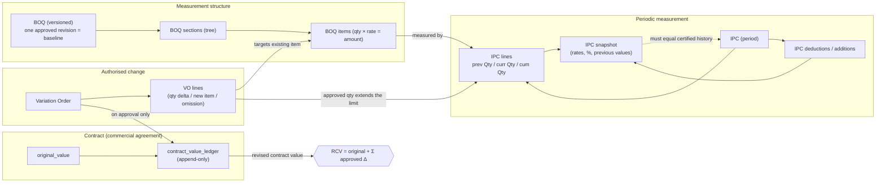
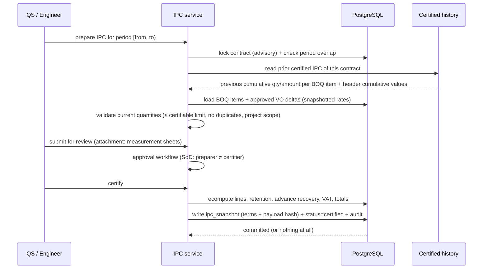

# K. BOQ / IPC / VO Relationship Design

This is the commercial core: the BOQ is what the client pays for, the VO changes it, the IPC
certifies measured progress against it, and the ledger records what the contract is now worth.

---

## 1. The relationship in one picture



---

## 2. Why three separate structures (not one tree)

| Structure | Answers | Owned by | Changes |
|---|---|---|---|
| **Revenue BOQ** | "What do we charge the client, line by line?" | Contract | Only via BOQ revisions / approved VOs |
| **Cost Budget** | "What do we intend to spend?" | Company (internal) | New versions / approved transfers |
| **WBS** | "Where and in what sequence is the work executed?" | Project | Freely restructured (it carries no money by itself) |
| **Cost codes** | "What kind of cost is it, in accounting terms?" | Company standard | Rarely; effective-dated deactivation |

The four are *linkable* (a budget line may point at a BOQ item and a WBS node; an expense may point
at a WBS node, a BOQ item and a cost code) but never merged. Merging them is the classic systems
failure: it makes the client-facing BOQ unusable for cost control, or forces the internal cost
structure to leak into certificates.

---

## 3. Revised Contract Value: only approved variations count

```
revised_contract_value = original_value + Σ contract_value_ledger.amount_delta
```

| VO status | Effect on contract value | Where the user sees it |
|---|---|---|
| `draft` | none | VO list only |
| `submitted` / `under_review` | **none** | "Pending variations (excluded from RCV)" card on the dashboard |
| `approved` | posted once as a ledger entry | RCV, profitability, dashboards |
| `rejected` / `cancelled` | none | history, with reason |
| `superseded` | the replacement VO carries the value | history retains both |

Implementation guarantees (all verified in Phase 0):

* The posting function is idempotent on `ledger_entry_id` / the unique source key; calling it twice
  returns the same entry, never a second one.
* The VO totals are **derived from the lines by the database**, so a client cannot submit a header
  amount that disagrees with its lines.
* After approval the VO is frozen (`VO_FROZEN`); corrections are `supersede` + new VO, which posts a
  corrective ledger entry.
* `contracts.current_value` is a cache; `Σ ledger` is authoritative, and the reconciliation job
  surfaces any drift.

---

## 4. How an approved VO extends what may be certified

An IPC certifies measured quantities. The quantity limit for a BOQ item is:

```
certifiable_quantity(item) = boq_item.quantity + Σ (approved VO quantity deltas targeting that item)
```

* VO lines with `boq_item_id` set extend that specific item (the overwhelmingly common case: extra
  concrete, extra excavation).
* VO lines without a BOQ item are **new items**: they are certified as IPC lines flagged
  `is_from_variation` with `variation_order_line_id` set, and the snapshot records the VO line's rate.
* Omission lines (negative deltas) **reduce** the certifiable quantity; approving an omission does not
  retroactively invalidate already-certified quantities, it reduces the remaining allowance (the
  difference is surfaced as a reconciliation warning if it would make cumulative certification exceed
  the revised quantity).
* `unit_rate` for variation work is the VO line's rate, snapshotted onto the IPC line — never
  re-read later.

---

## 5. IPC composition (previous / current / cumulative)



Non-negotiable properties:

1. `previous_*` comes from **certified history** (`app.validate_ipc_previous_values` refuses anything
   else).
2. The prior certificate is the one with the greatest `period_to < current.period_from`; a missing
   certificate is an error, not a silent zero.
3. Rates are snapshotted; a BOQ revision after certification cannot move money.
4. Retention, advance recovery, other deductions and additions are itemised
   (`ipc_deductions`/`ipc_additions`) with the header carrying the same figures as explicit
   previous/cumulative/current columns; the two agree by construction and are reconciled on every
   write.
5. The whole certification is one transaction; failure means nothing happened.

---

## 6. BOQ ↔ Budget ↔ Actual linkage

```
BOQ item  ──(optional)──▶ budget_lines.boq_item_id     "we plan to spend X on this sellable line"
BOQ item  ──(optional)──▶ expenses.boq_item_id         "this cost belongs to this sellable line"
WBS node  ──(optional)──▶ budget_lines.wbs_node_id / expenses.wbs_node_id
cost_code ──(required)──▶ budget_lines.cost_code_id / expenses.cost_code_id
```

This enables three views of the same project: by client structure (BOQ → earned value), by execution
structure (WBS → progress and responsibility), and by accounting structure (cost code → cost control).
The links are optional by design because forcing a 1:1 mapping is unrealistic on real projects; the
system therefore reports "unlinked cost" explicitly rather than hiding it.

All cross-structure references are **project-scoped composite foreign keys**, so a budget line or an
expense can never reference another project's WBS node or BOQ item — verified in Phase 0.

---

## 7. Transactional Excel import (BOQ and other bulk data)

The required flow is enforced by the schema, not by the UI:

```
Upload → parse → validate → preview → explicit confirmation → atomic commit / rollback
```

| Stage | Detail |
|---|---|
| **Upload** | File stored in private object storage; a `documents` row is created; size/type/sheet limited; checksum recorded |
| **Parse** | `import_batches` created (`uploaded → parsing`); rows written to `import_rows` with the raw cell values **and** the normalized values; formula cells are read as their cached values, and a formula in an amount column raises a warning |
| **Validate** | Per-row and per-batch checks: required fields, numeric parsing with locale awareness (`٬`, `,`, `.`), unit resolution, duplicate codes within the sheet **and** against the target BOQ, negative/zero rates, missing parent section references, section cycle detection, UOM mismatches, totals vs. the sheet's own total. Results: `error` (blocks) or `warning` (informational), stored in `import_validation_issues` with bilingual messages |
| **Preview** | The preview is a **read of the staged rows** (`import_rows`), not a temporary table written into the business tables. The user sees exactly what will be created/updated, per section, with counts and a total |
| **Confirmation** | Explicit action by a user with `boq.import`: stores `confirmed_by/at` and a `preview_hash` of the staged data |
| **Commit** | One transaction: advisory lock on the target BOQ → re-verify state (`still draft`, `preview_hash` unchanged) → **re-validate against current DB state** (someone may have changed data since the preview) → insert sections/items → recompute totals → assert the previewed total | 
| **Rollback** | Any failure rolls the whole transaction back: no partial BOQ exists, and the batch returns to a retryable state with the reason recorded |
| **Evidence** | The batch, its rows, its issues and the original file are retained permanently, so any BOQ can be traced to the exact file, sheet, row and user that produced it |

Additional rules:

* Importing into an **approved** BOQ is refused (the BOQ is the measurement baseline); the user must
  create a new revision or a VO.
* The import never trusts a total column in the spreadsheet: it validates the file's total against
  the computed sum and reports a discrepancy.
* Monthly imports (budget, expenses, collections) reuse the same pipeline and the same staging tables.
* Limits: 25 MB file, 20,000 rows for BOQ imports, 60-second validation budget, with progress
  reporting through the job system ([N](N-background-jobs.md)); larger workbooks are split by the user
  into sections.

---

## 8. Worked example (the acceptance scenario for Phase 1)

```
Project: Tower A. Contract: original 1,000,000.00, retention 5%, advance 100,000.00 @ 10% recovery.

BOQ revision 1: item 01.001 "Concrete C30", 1,000.000 m³ @ 450.5000 = 450,500.00

VO-001 (approved): +250 m³ of the same item @ 450.5000 = +112,625.00
      → ledger entry variation_approved, RCV 1,000,000.00 + 112,625.00 = 1,112,625.00
      → certifiable qty for 01.001 = 1,000 + 250 = 1,250 m³

IPC-0001 (period 2026-01-01 … 2026-01-31), no prior certificate:
      current 1,000 m³ @ 450.5000 = 450,500.00
      retention 5%                =  22,525.00
      advance recovery 10%        =  45,050.00
      net payable                 = 382,925.00
      VAT 15% on 382,925.00       =  57,438.75
      total payable               = 440,363.75      (all verified in Phase 0 to the halala)

IPC-0002 (February): previous = the certified January figures (read from history, not from the form),
      cumulative targets, and the remaining advance recovery of 54,950.00.
```

This scenario becomes an automated golden test so any change to the calculation engine is caught
immediately ([S §6](S-testing-strategy.md)).
