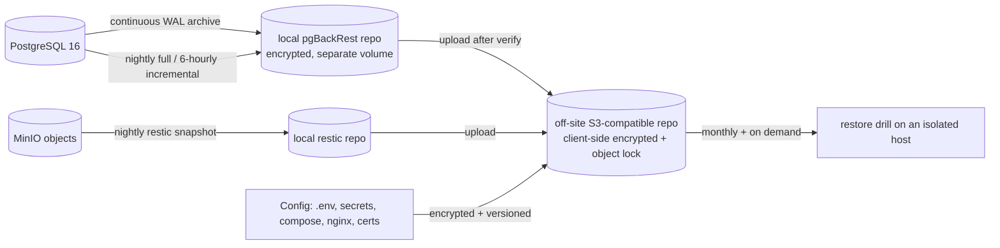

# O. Backup and Disaster-Recovery Design

Backups are the last line of defence for a financial system. **An untested backup is not a backup**;
therefore the design includes automated restore drills as a first-class requirement, not a hope.

---

## 1. Objectives (owner-confirmable)

| Metric | Target | Rationale |
|---|---|---|
| **RPO** (max data loss) | ≤ 15 minutes general; ≤ 5 minutes for financial write bursts | Continuous WAL archiving gives point-in-time recovery; the WAL archive interval is the dominant factor |
| **RTO** (time to service) | ≤ 4 hours for full restore on the same VPS; ≤ 8 hours on a fresh host | Realistic for a single-VPS deployment with a documented runbook and rehearsed drills |
| Data-scope RPO for documents | ≤ 24 hours | Object storage is replicated to the off-site repository on a schedule; database PITR to a point before a bad delete is *not* possible for objects (they are versioned instead) |
| Retention | 35 days of daily PITR window locally, 12 months of monthly fulls off-site, audit checkpoints retained per policy | Meets typical statutory and dispute windows; owner confirms exact numbers (decision D-06) |

---

## 2. Backup layers



| Layer | Tool | Frequency | Encryption | Notes |
|---|---|---|---|---|
| Physical base + WAL | pgBackRest | full nightly, incremental every 6 h, WAL continuously | Repo encrypted (AES-256, passphrase off-host) | Enables PITR to any second in the window |
| Off-site copy | pgBackRest → S3-compatible with **object lock / immutability** | after local success + verify | Client-side encrypted before upload | Immutability defeats ransomware and insider deletion |
| Object storage | restic (deduplicated, incremental) | nightly | Client-side encrypted | Covers documents, generated PDFs, import sources |
| Configuration & secrets metadata | Encrypted archive (compose, nginx config, cron, non-secret `.env` template) | on change | Encrypted | Secrets themselves are escrowed separately, never in Git |
| Audit checkpoints | JSONL export per company window | nightly | Encrypted, separate key | Proves the audit chain off-site ([L §4](L-audit-logging.md)) |

**Encryption keys are never stored next to the data.** They live in a secret store / password manager
held by the owner, with a documented break-glass copy in a physical safe. A VPS compromise must not
yield the ability to decrypt the off-site repository.

---

## 3. Backup reliability engineering

| Control | Implementation |
|---|---|
| Local verify | `pgbackrest verify` after every full; failure = P1 |
| Off-site verify | restore a single table/database from the off-site copy weekly into a scratch instance |
| Checksums | DB page checksums enabled; restic verifies with `--read-data-subset=5%` weekly |
| Monitoring | Backup age, last success, WAL archive lag alerted (see [Q](Q-observability.md)); "no backup in 24 h" is a critical alert |
| Isolation | Backups write to storage the app cannot reach with app credentials; the object-lock policy prevents deletion for the retention window even by the write credential |
| Restore tests | Monthly automated drill on an isolated host: restore latest full + WAL to a point in time in the past, run data-integrity assertions, verify the audit chain, record the result |
| Documentation | A runbook with exact commands, a checklist, and the expected error messages, stored both in Git and in the off-site config archive |
| Access | Restore credentials are separate from application credentials and are only usable interactively with MFA; restores into production require an approved change record |

---

## 4. Data-integrity assertions after restore (automated)

1. `Σ contract_value_ledger.amount_delta` equals `contracts.current_value` for every contract.
2. Every certified IPC has an `ipc_snapshots` row and a `certified_at`.
3. For each contract, IPC periods do not overlap and cumulative sequences are monotonic.
4. `Σ ipc_lines.current_amount` equals the IPC header work value for the certificate.
5. `Σ collection_allocations.amount ≤ collections.amount` everywhere, and IPC `amount_received`
   matches posted allocations.
6. `app.verify_audit_chain(company)` returns **no** rows for every company.
7. Row counts within tolerance of the pre-backup metric snapshot; migration version matches the
   application version.

A restore that fails any of these is treated as a failed drill, not a success.

---

## 5. Recovery scenarios and procedures

| Scenario | Action | Expected impact |
|---|---|---|
| Accidental deletion/update of rows (bad migration, bad deploy) | PITR to just before the event into a **staging** instance, extract the affected rows/tenant, replay selectively into production, then reconcile | Minutes–hours of specific data corrected without a full outage |
| Corrupted table/index | `pg_restore`/page-level recovery from the last full + WAL, or logical repair | Service degraded until repaired; no data loss beyond RPO |
| Ransomware on the VPS | Rebuild host from scratch, restore from **immutable** off-site repo, rotate all credentials | RTO per plan; RPO = last successful off-site upload |
| Total host loss | New VPS, restore, re-point DNS, verify | RTO per plan |
| Failed deploy | Roll back to the previous image tag; forward-only migrations mean a DB rollback requires a restore path — so breaking schema changes ship in two steps (expand, then contract) | Minutes |
| Object storage corruption | Restore affected prefix from restic | Documents only; DB unaffected |
| Regional/provider outage | Off-site copy is in a different provider/region (owner decision D-07) | RTO depends on the target environment |

---

## 6. Restore drill (automated monthly, manual quarterly)

```
1. Provision an isolated scratch host (separate from production networks).
2. Fetch the newest full + WAL from the OFF-SITE repository (not the local one).
3. Restore to a point in time 24 hours before "now".
4. Start a matching app container digest against it (read-only mode).
5. Run the integrity assertions of §4 and the tenant-isolation smoke tests.
6. Verify the audit chain and record the checkpoint hash.
7. Record: duration, RPO achieved, assertion results, and any manual step that was needed.
8. Tear down, wipe the scratch host, and store the report as evidence.
```

The drill report includes the *actual measured* restore duration, which is how the RTO claim in §1
stays honest over time as the database grows.

---

## 7. Honest limitations (stated for the owner)

1. **One VPS is one point of failure.** Between the failure and the completion of a restore the service
   is down. For tighter availability the next step is a warm standby: a second host with a streaming
   replica plus a promotion runbook, roughly doubling infrastructure cost.
2. **Object storage RPO is a schedule, not continuous.** A file uploaded at 23:00 and lost at 23:10
   may not exist in the off-site copy. Mitigated by object versioning and by the fact that documents
   are small and re-uploadable; a "no data loss" guarantee for files requires synchronous replication.
3. **Backups inherit application bugs.** If a bug corrupts data and is only noticed weeks later, the
   PITR window (35 days) may not reach back far enough; the monthly fulls extend the reachable window
   at the cost of granularity.
4. **Encryption keys are the single point of trust.** Losing them loses the backups; leaking them
   (together with the repository) exposes them. Escrow, separation and rotation are the mitigations.
5. **Restore time grows with data.** Drills measure it; the RTO target must be re-validated yearly.
