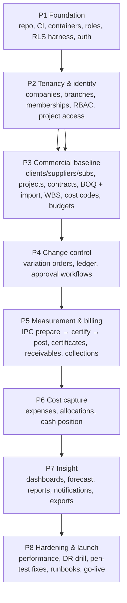

# T. Recommended Implementation Phases and Dependencies

Sequencing logic: **data isolation and money-correctness come before features**, because those are the
two things that cannot be retrofitted cheaply. Each phase ends in something the business can inspect
and use, and nothing in a later phase is a prerequisite for the correctness of an earlier one.

> This is a plan for **Phase 1 onward**. Phase 0 (design) ends here and waits for explicit approval.

---

## 1. Dependency graph

Hard dependencies worth stating explicitly:

* **RLS + roles + tenant-context plumbing (P1)** must exist before any tenant table is created,
  otherwise every later table has to be revisited.
* **Contract value ledger + VO approval (P4)** must exist before IPC certification, because
  `revised_contract_value` is what bounds certification and drives the forecast.
* **BOQ + BOQ import (P3)** must exist before measurement (P5); the import pipeline is then reused for
  budgets and expenses rather than built three times.
* **Approval workflow engine (P4)** is built once and reused by VO, IPC, budget and expense.
* **Cost capture (P6)** is deliberately after billing (P5): the first question the business asks is "how
  much have we certified and when will we be paid?", and cost capture can follow without blocking it.
* **Dashboards (P7)** depend on P5+P6 being live, otherwise they show empty shells.

---

## 2. Phase detail

### P1 — Foundation (isolation, identity, plumbing)
*Deliverable:* a deployable skeleton where a user can log in, and every subsequent table is guaranteed
tenant-safe by construction.

* Repository layout from [C](C-application-architecture.md); Docker Compose per [P](P-deployment-vps-docker.md)
  (app, worker, db, redis, object, proxy) with pinned images.
* CI pipeline with the gates of [S §10](S-testing-strategy.md) (early version: lint, tests, schema
  conformance, secrets, image scan).
* Database: `app`/`reporting` schemas, roles `app_migrator`/`app_rw`/`app_ro`/`app_backup`, grants,
  RLS helper functions and the **tenant-context middleware** (`SET LOCAL` + `reset_tenant_context`).
* Authentication per [H](H-authentication-sessions.md): Argon2id, MFA, sessions, lockouts, reset,
  audit of identity events.
* Audit infrastructure per [L](L-audit-logging.md): the append-only partitioned table, the hash-chain
  function, the generic row trigger, the verification job.
* The **two-tenant test harness** (fixtures + isolation suite) — built now, not later, so every later
  feature inherits it.
* Observability skeleton per [Q](Q-observability.md): health/readiness, structured logs, metrics, one
  Grafana dashboard, alert plumbing tested with a synthetic alert.
* Backup configuration per [O §2](O-backup-disaster-recovery.md) and **one successful restore drill**
  before any real data exists.

*Exit criteria:* login works; RLS fails closed under the runtime role; audit chain verifies;
isolation tests green; a restore drill has passed; CI blocks on the schema and isolation suites.

### P2 — Tenancy, roles, users, project access
*Deliverable:* a tenant can be provisioned and staffed with correct, provable access control.

* Companies/branches/settings/numbering/tax rates; onboarding flow (operator-provisioned in V1).
* Users, invitations, memberships, roles, permission catalogue, role templates, delegations, branch
  scopes.
* Project-level access (`project_members`, project-scoped permission sets).
* Permission-matrix test generation; route-parity CI check; the authorization choke point
  (`get_in_scope`, `require_project`, `scope_queryset`) used by every endpoint from here on.
* Admin UI (bilingual) for users/roles/branches with the same server-side checks as the API.

*Exit criteria:* the permission matrix passes; a user cannot grant beyond their own rights; project
scopes are enforced on list and detail endpoints; cross-tenant attempts produce 404 with no mutation.

### P3 — Commercial baseline (the project's commercial identity)
*Deliverable:* a project with a contract, a measureable BOQ, a WBS, cost codes and an approved budget.

* Clients, suppliers, subcontractors (+ contacts, party roles).
* Projects, project settings, parties, milestones, status history.
* Contracts (+ contract value ledger in place, empty and append-only).
* BOQ: sections, items (generated amounts), revisions, item versions.
* **BOQ Excel import** per [K §7](K-boq-ipc-vo-design.md): staging tables, validation, preview,
  explicit confirmation, atomic commit/rollback, evidence retention.
* WBS, cost codes, project cost-code selection, budgets and budget lines, budget transfers.
* Immutability guards wired for approved BOQ/budget.

*Exit criteria:* a realistic multi-section BOQ imports with correct totals and a full audit trail; a
20k-row import validates within budget; approved BOQ items resist modification; the import can be
traced to its source file; a failed commit leaves nothing behind.

### P4 — Change control (variations and approvals)
*Deliverable:* variations that provably change contract value exactly once, with approvals that cannot
be forged.

* Variation orders and lines (quantity deltas, new items, omissions).
* Approval workflow engine (definitions, steps, snapshot at submit, decisions, delegation, SoD,
  thresholds, escalation reminders).
* VO approval → contract value ledger posting (idempotent) → RCV cache → reconciliation job.
* BOQ quantity limits extended by approved VOs; pending VOs reported separately.
* Immutability + reversal/supersede paths.

*Exit criteria:* the Phase 0 behaviour holds in the application — an approved VO raises RCV exactly
once, a submitted VO raises nothing, a retried approval does not double-post, an approved VO cannot be
edited, and the reconciliation job reports zero drift.

### P5 — Measurement, certification and billing (the heart of the product)
*Deliverable:* monthly certificates that a client can sign and finance can reconcile, with
receivables that are always explainable.

* IPC preparation from BOQ + approved VOs with previous/current/cumulative quantities.
* Certification: server-side recomputation, snapshot write, period non-overlap, concurrency locks,
  immutability, reversal + re-issue.
* Deductions and additions (retention, advance recovery, penalty, other) as first-class itemised rows.
* Approval → approve → post lifecycle; payment status driven by allocations.
* Bilingual (AR/EN) PDF certificates rendered in the `pdf` container and linked to the snapshot hash.
* Receivables, aging, retention and advance tracking views; collections and allocations with limits
  and locks; collection reversal.
* Golden regression fixtures for the whole calculation engine.

*Exit criteria:* the [K §8](K-boq-ipc-vo-design.md) scenario passes end to end with exact halala
values; concurrent certification double-counting is impossible (proven by a real concurrency test);
certified documents are immutable; a client-supplied total can never affect a stored figure.

### P6 — Cost capture and cash position
*Deliverable:* actual cost and cash, so margin can be read alongside certified revenue.

* Expenses with allocations (WBS, BOQ item, cost code), approval, posting, immutability, reversal.
* Expense import (reusing the P3 pipeline).
* Cost commitments table left empty (procurement is out of scope) and displayed honestly as 0.
* Forecast cost: override records (author + reason) and the derived formula; project forecast view.
* Cash position: collections posted/allocated/unallocated, cash-in vs certified value, aging.

*Exit criteria:* a project shows certified revenue, actual cost, forecast cost and expected margin with
every number drillable to its rows; unlinked cost is reported, not hidden.

### P7 — Insight layer
*Deliverable:* the dashboards, reports and notifications that make the system used daily.

* Materialized views (project financial position, cost by cost code, company dashboard) with refresh
  strategy and as-of timestamps.
* Company and project dashboards with drill-down; pending variations shown outside RCV.
* Reports: BOQ vs budget, variation register, IPC register, receivables aging, cost by cost code,
  retention/advance schedules; bilingual XLSX and PDF exports (with formula-injection hardening).
* Notifications (approval requested, certified, import failed, overdue receivable) honoring
  preferences; in-app + email.
* Exception views: over-certification (if enabled), unlinked cost, contract-cache drift, overdue
  approvals.

*Exit criteria:* the owner's daily questions ("where do we stand, are we making money, who owes us
what?") are answered on one screen per project, with drill-down, in Arabic and English.

### P8 — Hardening, DR and launch
*Deliverable:* a system that survives contact with reality and an incident.

* Performance work from [S §9](S-testing-strategy.md) on realistic multi-tenant data.
* Security review: ZAP, IDOR spray, upload abuse, dependency and image findings fixed per SLA; optional
  external penetration test.
* Full DR exercise by the owner's team using the written runbooks ([O §6](O-backup-disaster-recovery.md)).
* Operational runbooks, on-call expectations, alert routing, monthly review rhythm ([Q §8](Q-observability.md)).
* Data migration/onboarding for the first real tenant (BOQ, contracts, opening balances) with
  reconciliation sign-off.
* Go-live checklist from [P §8](P-deployment-vps-docker.md).

*Exit criteria:* a rehearsed restore with measured RTO/RPO; no open critical security findings;
runbooks exercised by someone other than their author; the first tenant's opening positions reconciled
and signed off.

---

## 3. Cross-cutting workstreams (continuous, not phases)

| Workstream | Cadence |
|---|---|
| Security hardening & dependency patching | Weekly review; critical CVE patch within 72 h |
| Authorization matrix regeneration | Whenever a permission or route changes |
| Golden financial fixtures | Updated only with an explicit, reviewed change |
| Documentation (ADR per significant decision, runbooks) | In the same PR as the change |
| Backup verification | Every backup job run; restore drill per [O](O-backup-disaster-recovery.md) |
| Access review (roles, memberships, break-glass) | Monthly |
| Data-hygiene nudges (unlinked cost, missing evidence) | Surfaced in the UI, reported monthly |

---

## 4. Explicitly NOT in the plan (out of V1 scope)

Procurement (PR/RFQ/PO/GRN), subcontractor management and subcontract IPCs, site daily reports, RFIs,
submittals and the document-review matrix, inventory and warehouse, equipment and plant, HR/payroll and
timesheets, accounting/GL, banking integrations, client portals, ZATCA e-invoicing, Etimad/tender
integration, Mudad/GOSI, mobile apps, offline mode, custom per-tenant features, per-tenant physical
databases, Kubernetes.

Any of these requires an approved change to scope **and** an ADR; the schema leaves room for
procurement (`cost_commitments`) and for physical tenant separation ([F §9](F-tenant-isolation.md))
without committing to them now.

---

## 5. Suggested release cadence

| Release | Content | Audience |
|---|---|---|
| R0 (internal) | P1–P2 | Team; validates isolation and access, no business value yet |
| R1 (pilot) | P3–P4 | One friendly contractor: projects, contracts, BOQ, variations |
| R2 (production) | P5 | The money milestone: certificates, receivables, collections |
| R3 | P6–P7 | Full financial position and dashboards |
| R4 | P8 | Hardened, DR-proven, multi-tenant ready |

Each release ships only with its phase exit criteria met, its tests green, and its runbook updated. A
release that has not rehearsed its rollback does not ship.

---

## 6. What Phase 0 (this deliverable) hands over

1. A validated database specification (15 files) with proven tenant isolation, immutability, financial
   arithmetic and audit chaining on PostgreSQL 16.
2. Architecture documents A–T covering stack, infrastructure, modules, domain, schema, tenancy, RBAC,
   authentication, financial logic, document lifecycles, the BOQ/IPC/VO core, audit, storage, jobs,
   backups, deployment, observability, threats, testing and phasing.
3. The closing set: ADRs, ER diagrams, security checklist, risk register, open decisions.

**Phase 0 stops here and waits for the owner's explicit approval before any implementation begins.**
